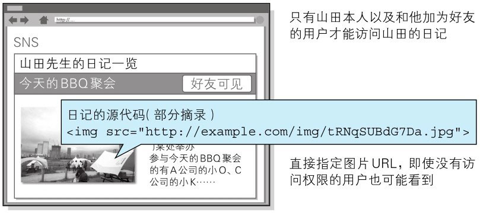
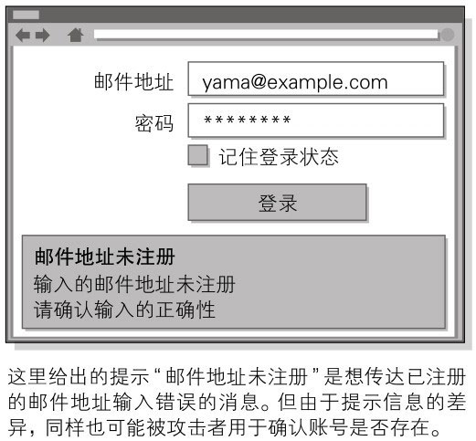
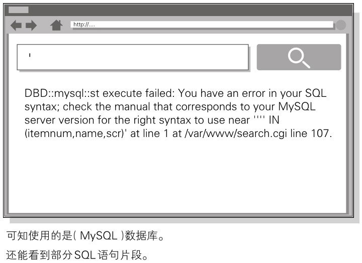

因设置或设计上的缺陷引发的安全漏洞是指，错误设置 Web 服务器，或是由设计上的一些问题引起的安全漏洞。


# 强制浏览

强制浏览（Forced Browsing）安全漏洞是指：**从安置在 Web 服务器的公开目录下的文件中，浏览那些原本非自愿公开的文件**。

强制浏览有可能会造成以下一些影响：

- 泄露顾客的个人信息等重要情报
- 泄露原本需要具有访问权限的用户才可查阅的信息内容
- 泄露未外连到外界的文件

对那些原本不愿公开的文件，为了保证安全会隐蔽其 URL。可一旦知道了那些 URL，也就意味着可浏览 URL 对应的文件。
直接显示容易推测的文件名或文件目录索引时，通过某些方法可能会使 URL 产生泄露。

**文件目录一览**

http://www.example.com/log/

通过指定文件目录名称，即可在文件一览中看到显示的文件名。

**容易被推测的文件名及目录名**

http://www.example.com/entry/entry_081202.log

文件名称容易推测（按上面的情况，可推出下一个文件是 entry_081203.log）

**备份文件**

http://www.example.com/cgi-bin/entry.cgi（原始文件）

http://www.example.com/cgi-bin/entry.cgi～（备份文件）

http://www.example.com/cgi-bin/entry.bak（备份文件）

由编辑软件自动生成的备份文件无执行权限，有可能直接以源代码形式显示

**经认证才可显示的文件**

直接通过 URL 访问原本必须经过认证才能在 Web 页面上使用的文件（HTML 文件、图片、PDF 等文档、CSS 以及其他数据等）

**强制浏览导致安全漏洞的案例**

下面我们以会员制度的 SNS 日记功能为例，讲解强制浏览可能导致的安全漏洞。
该日记功能保证了除具有访问权限的用户本人以外，其他人都不能访问日记。


> 图：强制浏览导致安全漏洞的案例

该日记中包含的图像照片的源代码如下所示：

```html

```

即使没有对这篇日记的访问权限，只要知道这图片的 URL，通过直接指定 URL 的方式就能显示该图片。
日记的功能和文本具有访问对象的控制，但不具备对图片访问对象的控制，从而产生了安全漏洞。


# 不正确的错误消息处理

不正确的错误消息处理（Error Handling Vulnerability）的安全漏洞是指，Web 应用的错误信息内包含对攻击者有用的信息。

与 Web 应用有关的主要错误信息如下所示：

- Web 应用抛出的错误消息

- 数据库等系统抛出的错误消息

  Web 应用不必在用户的浏览画面上展现详细的错误消息。对攻击者来说，详细的错误消息有可能给他们下一次攻击以提示。

**不正确的错误消息处理导致安全漏洞的案例**

- **Web 应用抛出的错误消息**

  下面以认证功能的认证错误消息为例，讲解不正确的错误消息处理方式。该认证功能，在输入表单内的邮件地址及密码匹配发生错误时，会提示错误信息。

  
  > 图：不正确的错误消息处理导致安全漏洞的案例

  上方画面提示“邮件地址未注册”的错误消息。当输入的邮件地址尚未在该 Web 网站上注册时，就会触发这条错误消息。
  因为倘若邮件地址存在，应该会提示“输入的密码有误”之类的错误消息。

  攻击者利用进行不同的输入会提示不同的错误信息这条，就可用来确认输入的邮件地址是否已在这个 Web 网站上注册过了。

  为了不让错误消息给攻击者以启发，建议将提示消息的内容仅保留到“认证错误”这种程度即可。

- **数据库等系统抛出的错误消息**

  下面我们以搜索功能提示的错误信息为例，讲解不正确的错误消息处理。本功能用于检索数据，当输入未预料的字符串时，会提示数据库的错误。

  
  > 图：不正确的错误消息处理导致安全漏洞的案例

  上方的画面中显示了与 SQL 有关的错误信息。对开发者而言，该信息或许在 Debug 时会有帮助，但对用户毫无用处。

  攻击者从这条消息中可读出数据库选用的是 MySQL，甚至还看见了 SQL 语句的片段。这可能给攻击者进行 SQL 注入攻击以启发。

  系统抛出的错误主要集中在以下几个方面：

  - PHP 或 ASP 等脚本错误
  - 数据库或中间件的错误
  - Web 服务器的错误

  各系统应对详细的错误消息进行抑制设定，或使用自定义错误消息，以避免某些错误信息给攻击者以启发。


# 开放重定向

开放重定向（Open Redirect）是一种对指定的任意 URL 作重定向跳转的功能。
而与此功能相关联的安全漏洞是指，假如指定的重定向 URL 到某个具有恶意的 Web 网站，那么用户就会被诱导至那个 Web 网站。

**开放重定向的攻击案例**

我们以下面的 URL 做重定向为例，讲解开放重定向攻击案例。该功能就是向 URL 指定参数后，使本来的 URL 发生重定向跳转。

```md
http://example.com/?redirect=http://www.tricorder.jp
```

攻击者把重定向指定的参数改写成已设好陷阱的 Web 网站对应的连接，如下所示：

```md
http://example.com/?redirect=http://hackr.jp
```

用户看到 URL 后原以为访问 example.com，不料实际上被诱导至 hackr.jp 这个指定的重定向目标。

可信度高的 Web 网站如果开放重定向功能，则很有可能被攻击者选中并用来作为钓鱼攻击的跳板。
