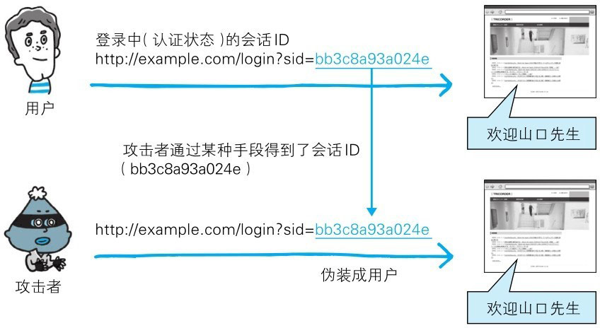
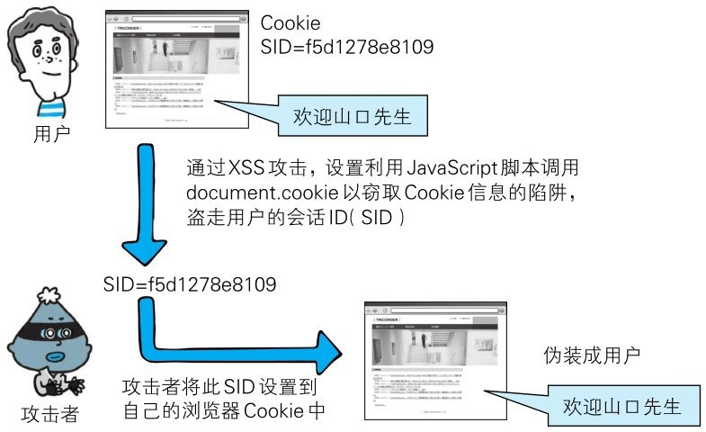
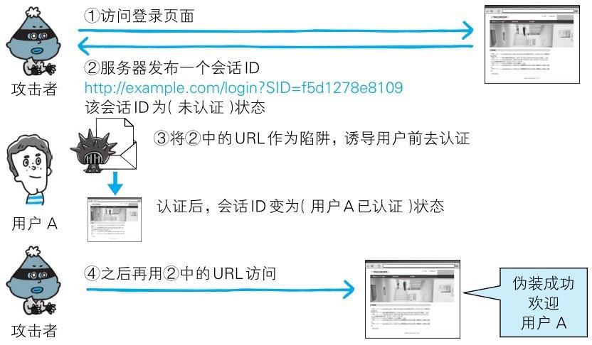
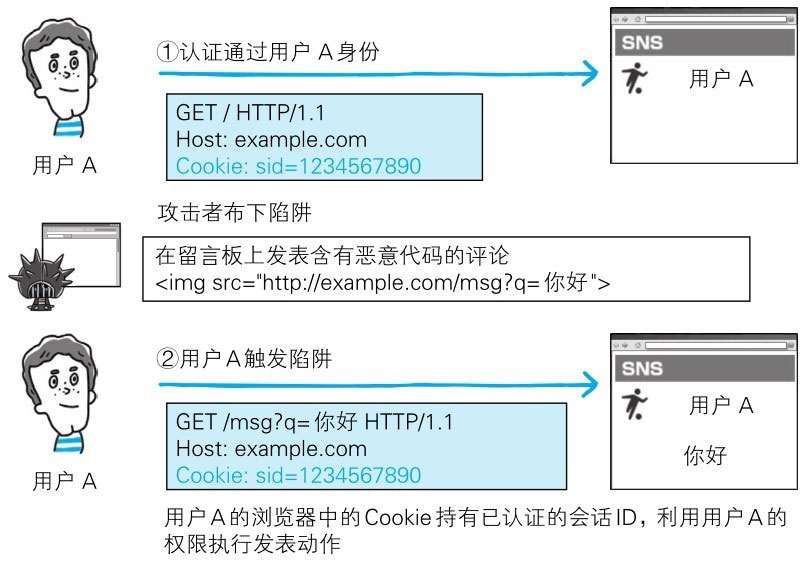

会话管理是用来管理用户状态的必备功能，但是如果在会话管理上有所疏忽，就会导致用户的认证状态被窃取等后果。

# 会话劫持

会话劫持（Session Hijack）是指攻击者通过某种手段拿到了用户的会话 ID，并非法使用此会话 ID 伪装成用户，达到攻击的目的。

> 图：会话劫持

具备认证功能的 Web 应用，使用会话 ID 的会话管理机制，作为管理认证状态的主流方式。
会话 ID 中记录客户端的 Cookie 等信息，服务器端将会话 ID 与认证状态进行一对一匹配管理。

下面列举了几种攻击者可获得会话 ID 的途径：

- 通过非正规的生成方法推测会话 ID
- 通过窃听或 XSS 攻击盗取会话 ID 
- 通过会话固定攻击（Session Fixation）强行获取会话 ID

**会话劫持攻击案例**

下面我们以认证功能为例讲解会话劫持。这里的认证功能通过会话管理机制，会将成功认证的用户的会话 ID（SID）保存在用户浏览器的 Cookie 中。

> 图：会话劫持攻击案例

攻击者在得知该 Web 网站存在可跨站攻击（XSS）的安全漏洞后，就设置好用 JavaScript 脚本调用 document.cookie 以窃取 Cookie 信息的陷阱，
一旦用户踏入陷阱（访问了该脚本），攻击者就能获取含有会话 ID 的 Cookie。

攻击者拿到用户的会话 ID 后，往自己的浏览器的 Cookie 中设置该会话 ID，即可伪装成会话 ID 遭窃的用户，访问 Web 网站了。

# 会话固定攻击

对以窃取目标会话 ID 为主动攻击手段的会话劫持而言，会话固定攻击（Session Fixation）攻击会强制用户使用攻击者指定的会话 ID，属于被动攻击。

**会话固定攻击案例**

下面我们以认证功能为例讲解会话固定攻击。这个 Web 网站的认证功能，会在认证前发布一个会话 ID，若认证成功，就会在服务器内改变认证状态。

> 图：会话固定攻击案例

攻击者准备陷阱，先访问 Web 网站拿到会话 ID（SID=f5d1278e8109）。此刻，会话 ID 在服务器上的记录仍是（未认证）状态。（步骤①～②）

攻击者设置好强制用户使用该会话 ID 的陷阱，并等待用户拿着这个会话 ID 前去认证。
一旦用户触发陷阱并完成认证，会话 ID（SID=f5d1278e8109）在服务器上的状态（用户A已认证）就会被记录下来。（步骤③）

攻击者估计用户差不多已触发陷阱后，再利用之前这个会话 ID 访问网站。
由于该会话 ID 目前已是（用户A已认证）状态，于是攻击者作为用户A的身份顺利登录网站。（步骤④）

**Session Adoption**

Session Adoption 是指 PHP 或 ASP.NET 能够接收处理未知会话 ID 的功能。

恶意使用该功能便可跳过会话固定攻击的准备阶段，从 Web 网站获得发行的会话 ID 的步骤。
即，攻击者可私自创建会话 ID 构成陷阱，中间件却会误以为该会话 ID 是未知会话 ID 而接受。

# 跨站点请求伪造

跨站点请求伪造 (Cross-Site Request Forgeries，CSRF）攻击是指攻击者通过设置好的陷阱，
强制对已完成认证的用户进行非预期的个人信息或设定信息等某些状态更新，属于被动攻击。

跨站点请求伪造有可能会造成以下等影响：

- 利用已通过认证的用户权限更新设定信息等
- 利用已通过认证的用户权限购买商品
- 利用已通过认证的用户权限在留言板上发表言论

**跨站点请求伪造的攻击案例**

下面以留言板功能为例，讲解跨站点请求伪造。该功能只允许已认证并登录的用户在留言板上发表内容。

> 图：跨站点请求伪造的攻击案例

在该留言板系统上，受害者用户A是已认证状态。它的浏览器中的 Cookie 持有已认证的会话 ID（步骤①）。

攻击者设置好一旦用户访问，即会发送在留言板上发表非主观行为产生的评论的请求的陷阱。
用户A的浏览器执行完陷阱中的请求后，留言板上也就会留下那条评论（步骤②）。

触发陷阱之际，如果用户A尚未通过认证，则无法利用用户A的身份权限在留言板上发表内容。
