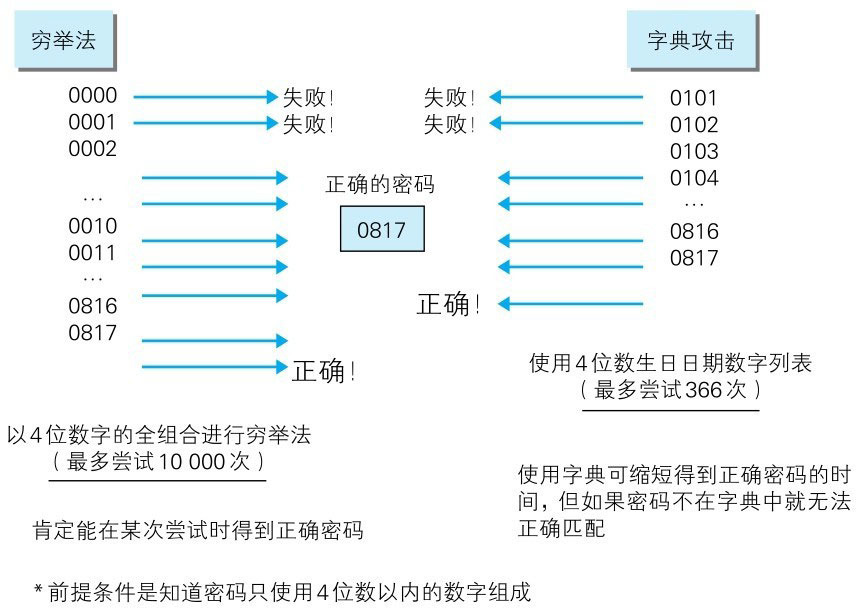
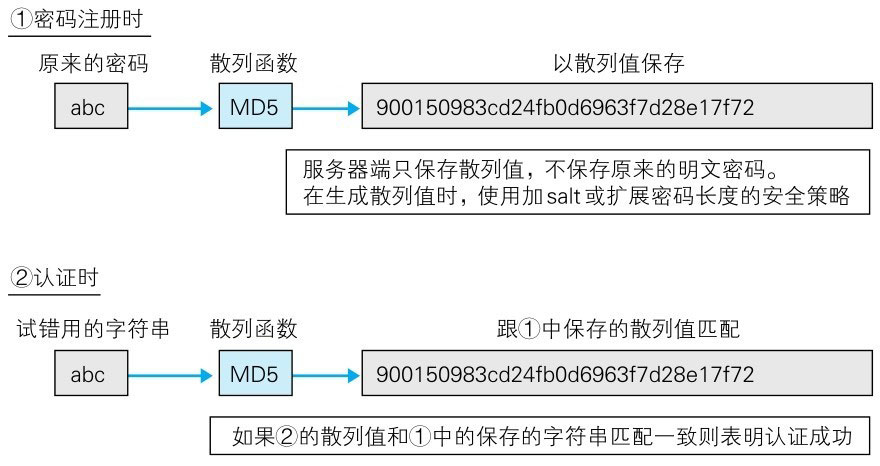
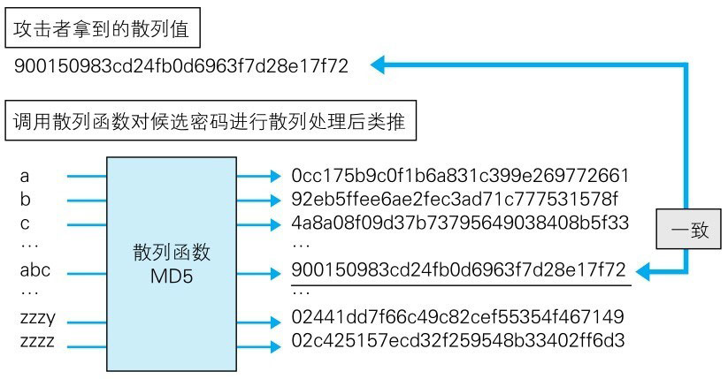
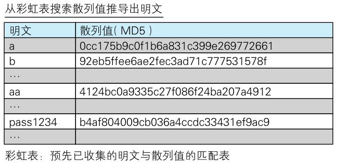
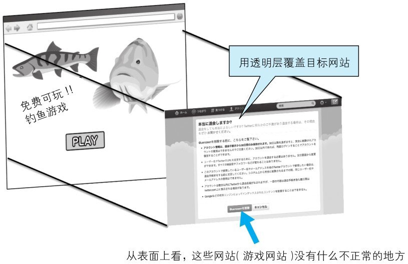
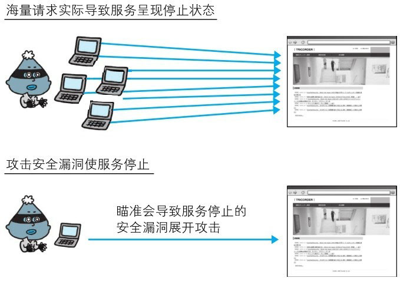

# 密码破解

密码破解攻击（Password Cracking）即算出密码，突破认证。
攻击不仅限于 Web 应用，还包括其他的系统（如 FTP 或 SSH 等），本节将会讲解对具备认证功能的 Web 应用进行的密码破解。

密码破解有以下两种手段：

- 通过网络的密码试错
- 对已加密密码的破解（指攻击者入侵系统，已获得加密或散列处理的密码数据的情况）

除去突破认证的攻击手段，还有 SQL 注入攻击逃避认证，跨站脚本攻击窃取密码信息等方法。


## 通过网络进行密码试错

对 Web 应用提供的认证功能，通过网络尝试候选密码进行的一种攻击。

主要有以下两种方式：

- 穷举法
- 字典攻击

### 穷举法

穷举法（Brute-force Attack，又称暴力破解法）是指对所有密钥集合构成的密钥空间（Keyspace）进行穷举。
即，用所有可行的候选密码对目标的密码系统试错，用以突破验证的一种攻击。

比如银行采用的个人识别码是由“4位数字”组成的密码，那么就要从0000～9999中的全部数字逐个进行尝试。
这样一来，必定在候选的密码集合中存在一个正确的密码，可通过认证。

因为穷举法会尝试所有的候选密码，所以是一种必然能够破解密码的攻击。
但是，当密钥空间很庞大时，解密可能需要花费数年，甚至千年的时间，因此从现实角度考量，攻击是失败的。

### 字典攻击

字典攻击是指利用事先收集好的候选密码（经过各种组合方式后存入字典），枚举字典中的密码，尝试通过认证的一种攻击手法。

还是举银行采用个人识别码是“4位数字”的密码的例子，考虑到用户使用自己的生日做密码的可能性较高，
于是就可以把生日日期数值化，如将0101～1231保存成字典，进行尝试。

与穷举法相比，由于需要尝试的候选密码较少，意味着攻击耗费的时间比较短。
但是，如果字典中没有正确的密码，那就无法破解成功。因此攻击的成败取决于字典的内容。


> 图：穷举法和字典攻击

> 利用别处泄露的 ID·密码进行攻击

> 字典攻击中有一种利用其他 Web 网站已泄露的 ID 及密码列表进行的攻击。
> 很多用户习惯随意地在多个 Web 网站使用同一套 ID 及密码，因此攻击会有相当高的成功几率。
> 根据警方的调查统计，成功入侵率有 6.7%。平成 23 年（2011 年）公布的非法访问行为的具体发生状况请参见 http://www.npa.go.jp/cyber/statics/h23/pdf040.pdf


## 对已加密密码的破解

Web 应用在保存密码时，一般不会直接以明文的方式保存，通过散列函数做散列处理或加 salt 的手段对要保存的密码本身加密。
那即使攻击者使用某些手段窃取密码数据，如果想要真正使用这些密码，则必须先通过解码等手段，把加密处理的密码还原成明文形式。


> 图：对已加密密码的破解

从加密过的数据中导出明文通常有以下几种方法：

- 通过穷举法·字典攻击进行类推
- 彩虹表
- 拿到密钥
- 加密算法的漏洞

### 通过穷举法·字典攻击进行类推

针对密码使用散列函数进行加密处理的情况，采用和穷举法或字典攻击相同的手法，尝试调用相同的散列函数加密候选密码，然后把计算出的散列值与目标散列值匹配，类推出密码。


> 图：破解已加密的密码 / 通过穷举法·字典攻击进行类推

### 彩虹表

彩虹表（Rainbow Table）**是由明文密码及与之对应的散列值构成的一张数据库表，是一种通过事先制作庞大的彩虹表，
可在穷举法·字典攻击等实际破解过程中缩短消耗时间的技巧。从彩虹表内搜索散列值就可以推导出对应的明文密码。**


> 图：破解已加密的密码 / 彩虹表

为了提高攻击成功率，拥有一张海量数据的彩虹表就成了必不可少的条件。
例如在 [Free Rainbow Tables](http://www.freerainbowtables.com/en/tables2/) 网站上公布的一张由大小写字母及数字全排列的1～8位字符串对应的 MD5 散列值构成的彩虹表，其大小约为 1050 吉字节。

### 拿到密钥

使用共享密钥加密方式对密码数据进行加密处理的情况下，如果能通过某种手段拿到加密使用的密钥，也就可以对密码数据解密了。

### 加密算法的漏洞

考虑到加密算法本身可能存在的漏洞，利用该漏洞尝试解密也是一种可行的方法。但是要找到那些已广泛使用的加密算法的漏洞，又谈何容易，因此困难极大，不易成功。

而 Web 应用开发者独立实现的加密算法，想必尚未经过充分的验证，还是很有可能存在漏洞的。


# 点击劫持

点击劫持（Clickjacking）是指利用透明的按钮或链接做成陷阱，覆盖在 Web 页面之上。
然后诱使用户在不知情的情况下，点击那个链接访问内容的一种攻击手段。这种行为又称为界面伪装（UI Redressing）。

已设置陷阱的 Web 页面，表面上内容并无不妥，但早已埋入想让用户点击的链接。
当用户点击到透明的按钮时，实际上是点击了已指定透明属性元素的 iframe 页面。

**点击劫持的攻击案例**

下面以 SNS 网站的注销功能为例，讲解点击劫持攻击。利用该注销功能，注册登录的 SNS 用户只需点击注销按钮，就可以从 SNS 网站上注销自己的会员身份。


> 图：点击劫持

攻击者在预料用户会点击的 Web 页面上设下陷阱。上图中钓鱼游戏页面上的 PLAY 按钮就是这类陷阱的实例。

在做过手脚的 Web 页面上，目标的 SNS 注销功能页面将作为透明层覆盖在游戏网页上。覆盖时，要保证 PLAY 按钮与注销按钮的页面所在位置保持一致。

> iframe 页面中使用透明可点击按钮的示例

```html
<iframe id="target" src="http://sns.example.jp/leave" 
        style="opacity:0;filter:alpha(opacity=0)"></iframe>
<button style="position:absolute;top:100;left:100;z-index:-1">PLAY</button>
```

由于 SNS 网站作为透明层覆盖目标网站，SNS 网站上处于登录状态的用户访问这个钓鱼网站并点击页面上的 PLAY 按钮之后，等同于点击了 SNS 网站的注销按钮。


# DoS 攻击

DoS 攻击（Denial of Service attack）是一种让运行中的服务呈停止状态的攻击。
有时也叫做服务停止攻击或拒绝服务攻击。DoS 攻击的对象不仅限于 Web 网站，还包括网络设备及服务器等。

主要有以下两种 DoS 攻击方式：

- 集中利用访问请求造成资源过载，资源用尽的同时，实际上服务也就呈停止状态
- 通过攻击安全漏洞使服务停止

其中，集中利用访问请求的 DoS 攻击，单纯来讲就是发送大量的合法请求。服务器很难分辨何为正常请求，何为攻击请求，因此很难防止 DoS 攻击。


> 图：DoS 攻击

多台计算机发起的 DoS 攻击称为 DDoS 攻击（Distributed Denial ofService attack，分布式拒绝服务攻击）。
DDoS 攻击通常利用那些感染病毒的计算机作为攻击者的攻击跳板。


# 后门程序

后门程序（Backdoor）是指开发设置的隐藏入口，可不按正常步骤使用受限功能。利用后门程序就能够使用原本受限制的功能。

通常的后门程序分为以下3种类型：

- 开发阶段作为 Debug 调用的后门程序
- 开发者为了自身利益植入的后门程序
- 攻击者通过某种方法设置的后门程序

可通过监视进程和通信的状态发现被植入的后门程序。但设定在 Web 应用中的后门程序，由于和正常使用时区别不大，通常很难发现。
