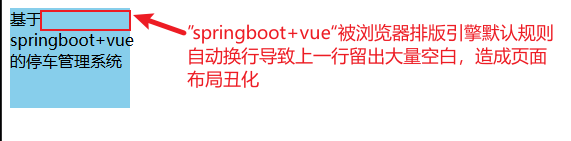
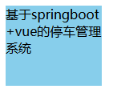

# 容器宽度未占满时长单词或连词字符默认断行规则导致上一行空出大量空白的问题


## 前言
::: info 背景
在网页布局中，经常会遇到这样的问题：当容器的宽度不足以容纳较长的单词或连词时，浏览器会自动将这些单词或连词进行断行。由于断行后，上一行可能会留出大量的空白，导致页面布局不美观。本文将探讨这一问题的原因，并提供有效的解决方案。
:::
::: details 示例代码
```html
<!DOCTYPE html>
<html lang="zh-CN">
<head>
  <meta charset="UTF-8">
  <meta http-equiv="X-UA-Compatible" content="IE=edge">
  <meta name="viewport" content="width=device-width, initial-scale=1.0">
  <title>文本断行示例</title>
  <style>
    .box {
      width: 120px;
      height: 100px;
      background-color: skyblue;
    }
  </style>
</head>
<body>

  <div class="box">基于springboot+vue的停车管理系统</div>
</body>
</html>
```
:::

**页面效果：**



在上面的示例中，容器的宽度为120px，但文本内容较长，导致文本自动断行，从而会出现上一行空出大量空白的问题。


## 原因

该问题主要源于 CSS 的 `word-break` 属性，它定义了单词如何在容器内断行。当容器的宽度不足以容纳长单词或连词时，默认的 `word-break: normal` 设置会导致文本按照正常的单词断行规则进行断行，进而在容器行内未完全占满的情况下，造成上一行留下空白。

### `word-break` 属性值

| 值                   | 作用                                                         |
| -------------------- | ------------------------------------------------------------ |
| `normal`（默认值）   | 使用默认的断行规则，即在适当的位置进行断行。                 |
| `break-all`          | 允许在任何字符之间断行，适用于 non-CJK（非中文/日文/韩文）文本。 |
| `keep-all`           | 禁止 CJK 文本断行，Non-CJK 文本表现同 `normal`。              |
| `break-word`（已弃用） | 类似 `word-break: normal` 和 `overflow-wrap: anywhere` 的组合效果。|

默认的断行规则可能无法满足某些情况下的布局需求，因此需要根据具体情况调整该属性的值。


## 解决方案

为了解决容器宽度不足时长单词或连词字符断行导致的多余空白问题，可以调整 CSS 的 `word-break` 属性。

### 调整 `word-break` 属性

将 `word-break` 属性设置为 `break-all`，使其在任意字符之间断行，从而避免出现上一行空出大量空白的情况。

```css
.box {
  width: 120px;
  height: 100px;
  word-break: break-all;
  background-color: skyblue;
}
```



这样，当遇到较长的单词或连词时，文本会在任意字符处断行，避免上一行出现多余的空白。


## 总结

当容器宽度不足以容纳长单词或连词字符时，浏览器会自动断行，可能导致上一行出现空白。
通过调整 CSS 的 `word-break` 属性为 `break-all`，可以有效避免这一问题，使页面布局更加美观。


