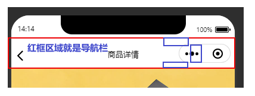

# uni-app 微信小程序：轻松实现自定义导航栏，提升用户体验

## 前言
当涉及微信小程序的界面设计时，我们常常会发现自带的导航栏功能相对简单，仅限于显示当前页面的标题。然而，在实际开发过程中，我们往往需要更多的自由度和个性化，以满足用户体验的需求。因此，自定义导航栏成为必然选择。

通过自定义导航栏，我们可以赋予小程序更多的设计灵活性和交互性，不再受限于传统的简单导航功能，更能突显个性化的特色，提升用户的整体体验感受。在本文中，我们将深入探讨如何实现自定义导航栏，并解释其对于微信小程序开发的重要性和实际应用的价值。

本文将介绍如何在 uniapp 中实现微信小程序的自定义导航栏，结合 pinia（或 Vuex）演示如何管理全局状态，确保导航栏的显示和交互效果。 如下：微信自定义的导航栏比较简单


看看滴滴出行，选择在导航栏部署选择城市、扫一扫等工具。


## 实现步骤

#### 1. 使用 pinia 存储设备相关的信息
在 uni-app 中，你可以使用 `pinia` 或 `Vuex` 来管理全局状态。我们需要创建一个 `deviceStore` 来存储设备信息，包括状态栏高度、胶囊按钮信息和导航栏高度。
`state` 中保存三个数据：`statusBarHeight`、`menuButtonInfo`、`navBarHeight`，`actions` 中 `getSystemInfoSync()` 方法获取设备信息，并保存到缓存中。
```js
// deviceStore.js
import { defineStore } from 'pinia'

export const useDeviceStore = defineStore('device', {
  state: () => ({
    statusBarHeight: uni.getStorageSync('statusBarHeight') || 0,
    menuButtonInfo: {},
    navBarHeight: uni.getStorageSync('navBarHeight') || 0,
  }),
  actions: {
    async getSystemInfoSync() {
      const systemInfo = uni.getSystemInfoSync()
      this.statusBarHeight = systemInfo.statusBarHeight // 手机状态栏的高度，这个状态来就是手机顶部的电量啊，信号这些区域的高度，如果是刘海屏，它还会包含刘海屏的高度
      this.menuButtonInfo = uni.getMenuButtonBoundingClientRect() // 胶囊信息,就是微信小程序自带的那个有关闭，分享按钮的胶囊。
      this.navBarHeight = this.menuButtonInfo.height + (this.menuButtonInfo.top - this.statusBarHeight) * 2 //状态栏与胶囊按钮中的空隙
    },
  },
})
```

#### 2. 定义自定义导航栏组件
创建一个自定义导航栏组件 `HeadNav.vue`，并在自定义导航栏的页面中引入该组件。组件内会检查是否已经缓存了 `statusBarHeight`、`navBarHeigh` 两个数据，如果没有，则调用 `deviceStore.getSystemInfoSync()` 方法获取设备信息。
这里我们使用固定的布局，你可以根据自己的需求提供自定义插槽，以实现自定义导航栏的布局和交互效果。
```vue
<!-- HeadNav.vue -->
<template>
  <view>
    <!-- 状态栏占位 -->
    <view :style="{ height: deviceStore.statusBarHeight + 'px' }"></view>
    <!-- 自定义导航栏内容 -->
    <view :style="{ height: deviceStore.navBarHeight + 'px' }" class="nav">
      <uni-icons type="back" size="30" class="nav-back" @click="goBack"></uni-icons>
      <image :src="avatar" class="nav-avatar" @click="gotoProfile"></image>
      <text class="nav-name" @click="gotoProfile">{{ nickname }}</text>
    </view>
  </view>
</template>

<script setup>
import { useDeviceStore } from '@/stores/deviceStore'
import { ref, onMounted } from 'vue'

const deviceStore = useDeviceStore()
const avatar = ref('')
const nickname = ref('')

onMounted(async () => {
  if (!deviceStore.statusBarHeight || !deviceStore.navBarHeight) {
    await deviceStore.getSystemInfoSync()
  }
})

const goBack = () => uni.navigateBack()
const gotoProfile = () => uni.navigateTo({ url: '/pages/profile/profile' })
  
</script>

<style scoped>
.nav {
  display: flex;
  align-items: center;
  background-color: #fff;
}
.nav-back {
  margin-left: 10px;
}
.nav-avatar {
  border-radius: 50%;
  margin-left: 10px;
}
.nav-name {
  margin-left: 10px;
}
</style>

```

#### 3. 配置页面使用自定义导航栏
设置允许自定义状态栏，uni-app 中在 `pages.json` 里面设置，微信小程序原生开发是在 `pages.json`（页面设置）或 `app.json`（全局设置）
```json
{
  "path": "pages/home/home",
  "style": {
    "navigationBarTitleText": "",
    "enablePullDownRefresh": false,
    "navigationStyle": "custom"
  }
}
```

## 注意事项
- **防止 iOS 橡皮筋拖拽效果**：可以使用 `fixed` 定位将导航栏区域固定在屏幕顶部，来防止导航栏区域在 `iOS` 设备上被 ”橡皮筋效果“ 拖拽导致的脱离区域。
- **适配不同屏幕**：为了适配各类屏宽的设备，导航栏中的元素大小的 `css` 单位不能使用类似 `rpx` 等相对页面宽度的单位，需要根据设计稿中的尺寸比对实际屏幕的尺寸，根据比例去换算应该设置的 `css` 尺寸，单位推荐 `px` 等绝对单位。

## 总结

- **页面上方区域**：状态栏 + 导航栏
  - **状态栏高度**：导航栏顶部到手机设备屏幕顶部的距离。
  - **导航栏高度**：胶囊按钮顶部到状态栏底部的空隙 + 胶囊自身高度 + 胶囊按钮底部到页面顶部的空隙。


- **封装成工具函数去获取**：创建工具函数 `getSystemInfo` 和 `getNavBarHeight` 来异步获取系统信息和计算导航栏高度。这些函数可以用于多个页面，简化代码。
:::details 
```js
/**
 * 异步获取系统信息
 * @description 基于{@link https://uniapp.dcloud.net.cn/api/router.html#animation uni.getSystemInfo}的二次封装，支持同步获取异步获取
 * @param {object} [opts]
 * @param {Function} [opts.success] 接口调用成功的回调
 * @param {Function} [opts.fail] 接口调用失败的回调函数
 * @param {Function} [opts.complete] 接口调用结束的回调函数（调用成功、失败都会执行）
 * @returns {Promise<unknown>}
 * @example
 * // 异步方式：
 * // callback
 * getSystemInfo({ success() {} })
 * // promise
 * getSystemInfo().then(res => {})
 * // 同步方式: async await
 * const { statusBarHeight } = await getSystemInfo()
 */
export function getSystemInfo(opts) {
  return new Promise((resolve, _) => {
    return uni.getSystemInfo(
      Object.assign(
        {
          success: (res) => resolve(res),
          fail: (err) => resolve(err),
        },
        opts ?? {}
      )
    )
  })
}

/**
 * 获取导航栏高度（页面上方区域：状态栏 + 导航栏）
 * @returns {Promise<number>}
 * @example
 * // 异步方式：Promise
 * getNavBarHeight().then(res => {})
 * // 同步方式: async await
 * const { statusBarHeight } = await getSystemInfo()
 */
export async function getNavBarHeight() {
  // 获取状态栏高度
  const { statusBarHeight } = await getSystemInfo()
  // 获取菜单按钮（右上角胶囊按钮）的布局位置信息。坐标信息以屏幕左上角为原点。单位px
  const menuBtnInfo = uni.getMenuButtonBoundingClientRect()
  // 自定义导航栏高度 = 胶囊按钮自身的高度 + 胶囊上边界到状态栏底部的距离 + 胶囊下边界到页面顶部的距离
  // 由于拿不到页面顶部在屏幕中的布局信息，我们就不能通过页面顶部的top - menuBtnInfo.bottom的方式计算出距离
  // 但是，根据社区及网上资料可以看出，胶囊下边界到页面顶部的距离与胶囊上边界到状态栏底部的距离应该是一致的
  // 所以得出：胶囊下边界到页面顶部的距离 = 胶囊上边界到状态栏底部的距离
  return menuBtnInfo.height + (menuBtnInfo.top - statusBarHeight) * 2
  // 还有一种计算方式也是可以的：
  // 胶囊按钮下边界到状态栏底部的距离 + 胶囊按钮上边界到状态栏底部的距离
  // 这两种计算方式都是基于：胶囊下边界到页面顶部的距离 = 胶囊上边界到状态栏底部的距离
  // return (menuBtnInfo.bottom - statusBarHeight) + (menuBtnInfo.top - statusBarHeight)
}
```
:::


## 相关资料

- [Uniapp微信小程序：轻松实现自定义导航栏，提升用户体验](https://developers.weixin.qq.com/community/develop/article/doc/0006ca48ce4230bbaff03a38566813?highline=%E8%87%AA%E5%AE%9A%E4%B9%89%E5%AF%BC%E8%88%AA%E6%A0%8F)
