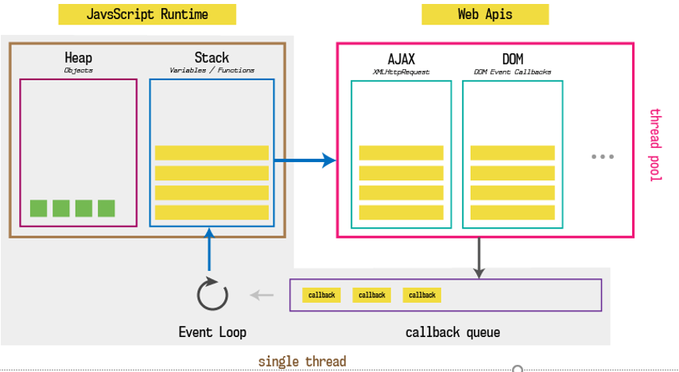
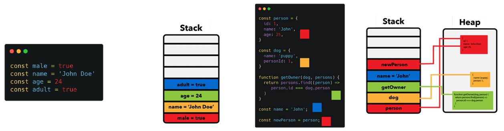
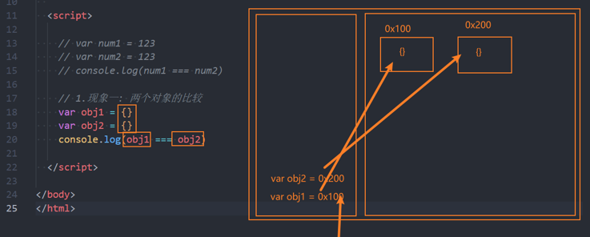
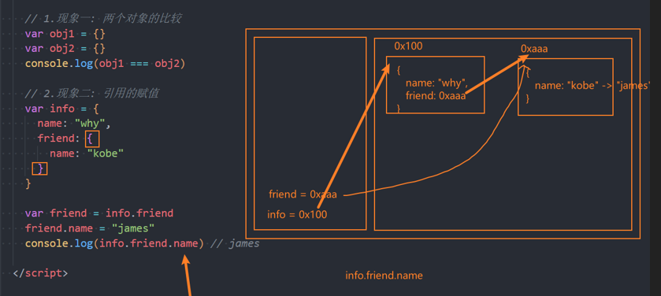
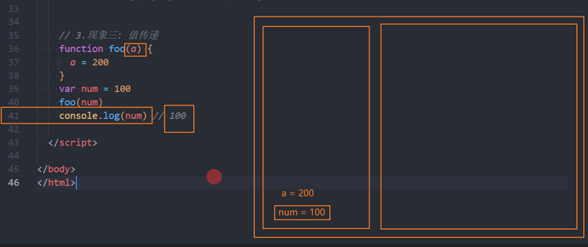
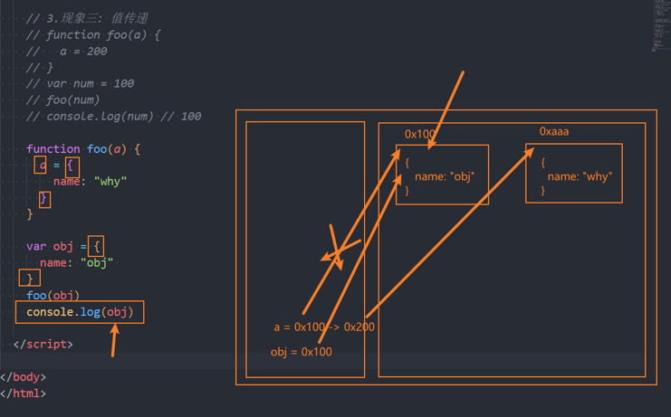
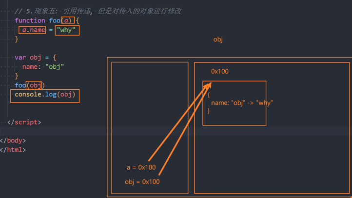
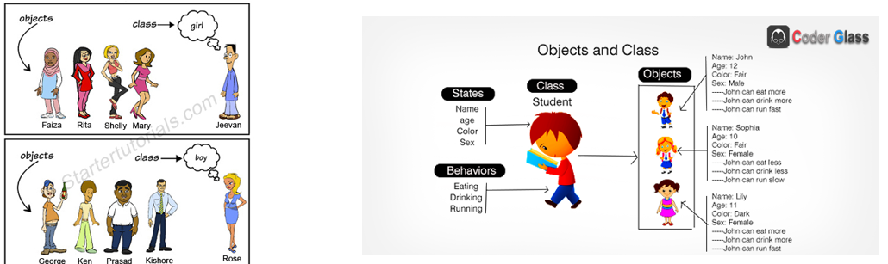
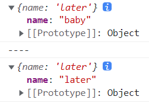
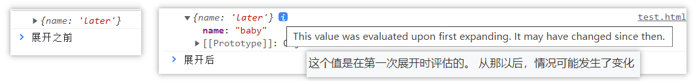

# 一. 对象类型


## 认识对象类型

::: info
在 JavaScript 的数据类型中，有一类非常重要且贯穿始终的类型 —— 对象类型（Object）。

> "对象类型几乎参与 JS 的所有核心机制（作用域、原型链、this、模块、框架设计等）"。
>
> 掌握对象类型，是理解 JavaScript 的关键基础。
:::

### 什么是对象类型

**对象类型是一种用于存储键值对（key-value）的复杂数据类型。**

- 每一组数据由：key: value 组成
- 对象可以同时描述：
  > 属性（特性、状态）  
  > 方法（行为，本质是函数）

```js
var obj = {
  name: 'later',
  age: 23,
  run: function () {
    console.log('running')
  }
}
```
> 对象中的函数，通常称为 方法（method）。

::: tip
在 JavaScript 中，对象的方法本质上也是对象的属性，只不过当属性值是函数时，通常称该属性为“方法”。
:::

### 为什么需要对象类型

基本数据类型（Number、String、Boolean 等）只能表示**单一、简单的值**，而现实中的事物往往是**多维度的**。

例如：
- 一个「人」 
  > 特性：姓名、年龄、身高   
  > 行为：学习、工作、跑步
- 一辆「车」 
  > 特性：颜色、重量、速度   
  > 行为：行驶、刹车

**对象类型的作用：将“属性 + 行为”组织成一个整体，用于描述复杂事物**。

### 对象中 key 和 value 的规则

- `key`（属性名，property name） 
  > 本质是：字符串 或 Symbol（ES6 新增）   
  > 写对象字面量时，字符串 key 的引号通常可以省略  
  > 属性之间是以逗号（comma）分割  
  > 非字符串类型的 key（如 Number）会被隐式调用 toString() 转换为字符串
  ```js
  var obj = {
    123: 'number key',    // key 实际等价于 '123'
    true: 'boolean key',  // key 实际等价于 'true'
    name: 'later',        // key 实际等价于 'name'
  }
  ```

- `value`（属性值, property value）
  > 可以是任意类型：基本类型、函数、对象、数组 等


## 创建对象的方式

JavaScript 中常见的对象创建方式有三种：

### **对象字面量**（最常见，`Object Literal`）

```js
var obj = {
  name: "later"
}
```

> 语法最简洁   
> 可读性最好   
> 前端开发中使用频率最高

### **new Object() + 动态添加属性**

```js
var obj = new Object() // Object 构造函数

obj.name = "later"
```

> 本质上与对象字面量一致   
> 实际开发中较少使用

### **new 构造函数**

```js
function Person() {}

var obj = new Person()
```

> 用于批量创建对象   
> 与原型、面向对象编程密切相关


当前阶段重点掌握：对象字面量方式 即可。后续学习其他两种方式


## 对象的基本操作

```js
// 定义对象
var obj = {
  name: 'later'
}

// 1.访问对象属性：对象.属性名
console.log(obj.name)

// 2.修改对象属性
obj.name = 'sensen'

// 3.添加对象属性
obj.age = 23

// 4.删除对象属性：delete 操作符
delete obj.age
```


## 点语法 vs 方括号语法

### 点语法的限制

点语法要求属性名必须是**合法的变量标识符**：

> 不能包含空格  
> 不能以数字开头  
> 不能包含特殊字符（$、_ 除外）

```js
var obj = {
  'good friend': 'later'
}

// 点语法 不支持
obj.good friend // ❌ 语法错误：';' expected.
```

### 方括号语法（更灵活）

方括号在定义或操作属性时更灵活，方括号内可以是任意的字符串、变量、表达式 等。

```js
var obj = {
  'good friend': 'later'
}

obj['good friend'] // ‘later'

var key = 'name'
obj[key] // 等价于 => obj.name
```

- 常用于：
  > key 中包含特殊字符  
  > key 是变量


## 对象的遍历（迭代）

> 遍历对象：**表示获取对象中所有的可枚举属性**。


方式一：Object.keys() + for 循环（推荐）
> `Object.keys()` 方法会**返回一个由给定对象的自身可枚举属性组成的字符串数组**。

```js
var info = { name: 'later', age: 23 }
var infoKeys = Object.keys(info)

for (var i = 0; i < infoKeys.length; i++) {
  var key = infoKeys[i]
  var value = info[key]
  console.log(`key: ${key}, value: ${value}`)
}

// output:
// key: name, value: later
// key: age, value: 23
```
> 特点：  
> 只遍历对象 自身的可枚举属性   
> 顺序稳定  
> 更可控，工程中更常见

方式二：`for...in` 遍历
> 任意顺序迭代一个对象的除 Symbol 以外的可枚举属性, 包括原型链上继承过来的可枚举属性。

```js
var info = { name: 'later', age: 23 }
for (var key in info) { 
  var value = info[key]
  console.log(`key: ${key}, value: ${value}`)
}
```
> 特点：  
> 遍历对象 自身的可枚举属性 + 从原型链上继承过来的可枚举属性（可搭配 `hasOwnProperty()` 使用，来排除继承过来的属性）  
> 顺序不固定  
> 不遍历 Symbol 属性  


# 二. 内存中的值类型和引用类型

::: info
本节目标：
> "理解 JavaScript 中「值是如何存储在内存中的」"  
> "搞清楚 值类型 vs 引用类型 的本质差异"  
> "为后续理解：函数参数、对象拷贝、闭包、响应式等打基础"
:::


## 认识内存（Memory）

计算机存储器（`Computer memory`）是一种利用[半导体](https://zh.wikipedia.org/wiki/半導體)、磁性介质等技术制成的存储[资料](https://zh.wikipedia.org/wiki/資料)的电子设备，其[电子电路](https://zh.wikipedia.org/wiki/電子電路)中的资料以[二进制](https://zh.wikipedia.org/wiki/二进制)方式存储，是**用来存储程序运行过程中产生的数据的硬件设备**。

> 存储器分为**主存储器**（main memory，简称：主存/内存，又称“内存储器”）和 **辅助存储器**（auxiliary memory，简称：辅存/外存，又称“外存储器”）。

> 内存储器与中央处理器（CPU）一起构成主机，用来存放计算机运行时随时需要使用的程序和数据，一切数据要被CPU操作都必须先装入内存。内存的工作速度较快，存储容量较小，主要采用半导体存储器。

> 目前大部分计算机系统的主存储器主体为动态随机存储器（DRAM），“主存储器”乃至“存储器”一词有时特指DRAM；另外，静态随机存储器（SRAM）与只读存储器（ROM）等也可作主存储器的一部分。

> 辅助存储器和输入输出设备都属于外设，用来存放CPU运行时暂时不用的各种程序和数据，一般在断电后仍能保存。辅助存储器的存储容量大，工作速度慢，例子如硬盘、U盘、光盘、磁带等。

简单理解：
- 程序运行前：代码在磁盘（外部存储）
- 程序运行时： 
  > 被加载到 内存（主存）   
  > 由 CPU 直接读取和执行

内存的特点：
- 内存是 CPU 可以直接寻址 的存储空间 
- 相比磁盘： 
  > 访问速度快   
  > 容量较小   
  > 断电数据丢失  


## 栈内存（Stack）与 堆内存（Heap）

程序在运行时，先加载到内存中由 CPU 来执行，内存通常可以从逻辑上划分为两个区域：**栈内存和堆内存**。

| 内存区域 | 特点                                              | 主要存储                                           |
| --- |-------------------------------------------------|------------------------------------------------|
| 栈内存 | 连续的内存空间、<br/> 存取速度快、<br/> 生命周期明确（函数调用结束即释放）     | 基本（原始）类型的值、<br/> 变量名与其对应的值、<br/> 函数调用相关信息（调用栈） |
| 堆内存 | 非连续的内存空间、<br/> 存取速度慢、<br/> 生命周期不固定（由 GC 回收）<br/> | 对象类型（Object / Array / Function 等）的实际数据         |

> **原始(基本)类型**占据的空间是在**栈内存**中分配的  
> **对象(复杂)类型**占据的空间是在**堆内存**中分配的  
  

  


## 值类型和引用类型

### 值类型（Primitive / 值拷贝）

原始类型的保存方式：在变量中保存的是值本身，所以**原始类型**又称为**值类型**。

```js
var a = 111
var b = a // a 和 b 互不影响
b = 222

console.log(a) // 111
console.log(b) // 222
```
> 特点：  
> 值类型保存的是值本身，所以值类型又称为值拷贝  
> 赋值或传参时，会发生 值拷贝

### 引用类型（Reference / 引用拷贝）

对象类型的保存方式：在变量中保存的是对象的 "引用"，所以**对象类型**又称为**引用类型**。

```js
var obj1 = { name: '111' }
var obj2 = obj1 // 两个变量指向同一个对象

obj2.name = '222'
console.log(obj1.name) // 222
```

> 特点：  
> 对象的实际数据存储在 堆内存  
> 变量中保存的是：堆内存地址（引用）

### 值类型 vs 引用类型
| 对比项 | 值类型 | 引用类型 | 
|---|---|-|
| 存储位置 | 栈 | 栈(引用） + 堆（实际数据） |
| 变量中保存 | 值本身 | 堆内存地址（引用） |     
| 复制行为 | 值拷贝 | 引用拷贝 |
| 相互影响 | 否 | 是 |



::: tip
> 变量名、原始类型都是存储在栈内存中，只有对象类型的值（实际数据）是存储在堆内存中。  
> 对象类型的变量名存储在栈内存中，其保存的并不是实际数据，而是堆中对象类型值的内存地址（指针/引用）。
:::

## 现象解析

### 现象一：比较两个变量

```js
var a = 123
var b = 123
console.log(a === b) // true
// 因为原始类型在变量中保存的是值本身，这里是值的比较，123 是等于 123 的

var m = {}
var n = {}
console.log(m === n) // false 
// 因为对象类型在变量中保存的是内存地址，只要写的是个对象字面量形式的大括号，在堆内存中就会创建一个新对象，
// 这里是创建了两个对象，在堆中的内存地址不同，所以比较的时候是不相等的
```

原因分析：
> 值类型：比较的是「值」  
> 引用类型：比较的是「内存地址」  
> 每一个对象字面量 {} 都会在堆中创建一个新对象



### 现象二：引用赋值（共享同一对象）

```js
var info = {
  // 对象类型中的基本数据类型，会直接保存在当前对象所在的堆内存中，
  // 因为堆内存本身就是一块空间，空间本身就可以放东西，
  // 因此对象类型中的值类型就存储在该对象所在的堆内存中的，所以'18'这个字符串就存储在该对象所在的堆内存中
  age: '18',
  friend: {
    name: "kobe"
  }
}
// 虽然 info 变量的值本身是一个对象类型，JS引擎会在堆内存中分配一个空间用来存储 info 的值，
// 但 friend 属性的值是对象类型，JS引擎会在堆内存中新分配一个空间用来存储 info.friend 属性的值，
// 而 var friend 变量实际保存的是值在堆内存中的分配的内存地址

var friend = info.friend
friend.name = "james"
console.log(info.friend.name) // james
```

原因分析：
> info.friend 保存的是一个对象引用    
> friend 拿到的是 同一个引用  
> 修改的是堆中同一块数据



### 现象三：值类型作为函数参数传递

```js
function foo(a) {
  a = 200         // a:100 -> a = 200
}

var num = 100
foo(num)          // 传递的参数是值类型，所以传递的是值的副本
console.log(num)  // 100
```

原因分析：
> 函数参数本质是一次 赋值操作   
> 值类型传递的是「值的副本」



### 现象四：引用类型传递 + 不修改引用值

```js
function foo(a) {
  a = { name: 'why' } // 没有修改传过来的 obj，而是创建了一个新对象
}

var obj = { name: 'obj' }
foo(obj)              // 引用传递，传递的 obj 值的内存地址
console.log(obj)      // { name: 'obj' }
```

原因分析：
> 传入的是引用（地址）  
> 但函数内部：让参数 a 指向了 新的对象，并没有修改原对象



### 现象五：引用类型传递 + 修改引用值

```js
function foo(a) {
  a.name = 'why'  // 对传递过来的 obj 的堆中的 值进行了修改
}
var obj = {name: 'obj'}
foo(obj)          // 引用传递，传递的 obj 值的内存地址
console.log(obj)  // { name: 'why' }
```

原因分析：
> 通过引用，直接修改了堆中的对象数据




# 三. 函数的 this 执行

::: info
本节目标： 
> "理解 this 为什么存在"   
> "搞清楚 this 到底指向谁"   
> "建立一套可推导的 this 判断模型，而不是死记结论"
:::


## 为什么需要 this？

在常见的编程语言中，几乎都有 `this` 这个关键字（Objective-C 中使用的是 `self`），但是 JS 中的 `this` 和常见的面向对象语言中的 `this` 不太一样：

> 大多数面向对象的编程语言中，如 `Java、C++、Swift、Dart` 等一系列语言中，`this` 通常只会出现在类的方法中（特别是实例方法）。`this` 代表的是当前实例对象。

### JS 中的特殊性

`JavaScript` 中的 `this` 与传统面向对象语言 **有本质不同**：

> JS 中 函数是“一等公民”   
> 函数可以：独立调用、作为对象方法调用、作为回调函数、被显式绑定

> 因此：**JS 中的 this，不取决于函数定义在哪，而取决于函数“如何被调用”**

### 不使用 this 的问题

```js
var obj = {
  name: 'later',
  running: function () {
    console.log(obj.name + ' running')
  },
  eating: function () {
    console.log(obj.name + ' eating')
  },
}
```

> 问题：  
> 方法内部 **强依赖外部变量名 obj**   
> 一旦对象被：赋值给其他变量、拷贝、作为参数传递，方法立刻失效或语义错误。

### 使用 this 的好处

> **this 是为了解决“方法复用 + 动态对象”的问题而存在的。**

```js
var obj = {
  name: 'later',
  running: function () {
    console.log(this.name + ' running')
  },
  eating: function () {
    console.log(this.name + ' eating')
  },
}
```

> 优势：  
> 方法 **与对象名解耦**    
> 同一方法可以被多个对象复用  
> this 在调用时动态确定


## this 指向什么？

> **this 的指向，取决于函数的调用方式，而不是定义位置。**

目前掌握两个判断方法，足以解释 80% 的 this 问题：

> 方法一：默认的方式调用一个函数，this 指向全局对象  
> 方法二：通过对象调用，this 指向调用的对象 

### 默认函数调用（独立调用）

```js
function foo() {
  console.log(this)
}

foo() // window
```
> 解释：   
> 函数独立调用   
> 没有明确的调用者   
> this 指向全局对象（浏览器中是 window，严格模式下是 undefined）

### 作为对象的方法调用

```js
var obj = {
  bar: function() {
    console.log(this)
  }
}
obj.bar() // obj
```

> 解释：   
> 调用点在 obj.bar()   
> this 指向 调用该方法的对象 obj


# 四. 工厂方法创建对象

---

## 1. 类和对象的思维方式

- 我们来思考一个问题：如果需要在开发中创建一系列的相似的对象，我们应该如何操作呢？

- 比如下面的例子：

  - 游戏中创建一系列的英雄（英雄具备的特性是相似的，比如都有名字、技能、价格，但是具体的值又不相同）
  - 学生系统中创建一系列的学生（学生都有学号、姓名、年龄等，但是具体的值又不相同）

- 当然，一种办法是我们创建一系列的对象：

  ```js
  // 一系列的学生对象
  // 重复代码的复用: for/函数
  var stu1 = {
    name: "why",
    age: 18,
    running: function() {
      console.log("running~")
    }
  }
  var stu2 = {
    name: "kobe",
    age: 30,
    running: function() {
      console.log("running~")
    }
  }
  var stu3 = {
    name: "james",
    age: 25,
    running: function() {
      console.log("running~")
    }
  }
  ```

- 这种方式有一个很大的弊端：创建同样的对象时，需要编写重复的代码

  - 我们是否有可以批量创建对象，但是又让它们的属性不一样呢？

## 2. 创建对象的方案 - 工厂函数

---

- 我们可以想到的一种创建对象的方式：工厂函数

  - 我们可以**封装一个函数**，这个函数用于帮助我们**创建一个对象**，我们只需要重复调用这个函数即可
  - **工厂模式**其实是一种常见的**设计模式**

  ```js
  function createPerson(name, age, address) {
    var p = new Object()
    p.name = name
    p.age = age
    p.address = address
    p.running = function() {
      console.log(this.name + '在跑步')
    }
    return p
  }
  
  var p1 = createPerson('张三', 18, '广州')
  var p2 = createPerson('李四', 22, '深圳')
  console.log(typeof p1) // object
  ```


# 五. 构造函数和类(ES5)

---

## 1. 认识构造函数

- 工厂方法创建对象有一个比较大的问题：我们在打印对象时，对象的类型都是`Object`类型
- 但是从某些角度来说，这些对象应该有一个他们共同的类型
- 下面我们来看一下另外一种模式：构造函数的方式
- 我们先理解什么是构造函数？
  - 构造函数也称之为构造器（`constructor`），通常是我们在创建对象时会调用的函数
  - 在其他面向的编程语言里面，构造函数是存在于类中的一个方法，称之为构造方法
  - 但是`js`中的构造函数有点不太一样，构造函数扮演了其他语言中类的角色
- 也就是在`js`中，构造函数其实就是类的扮演者：
  - 比如系统默认给我们提供的`Date`就是一个构造函数，也可以看成是一个类
    - 在`ES6`之前，我们都是通过`function`来声明一个构造函数（类）的，之后通过`new`关键字来对其进行调用
  - 在`ES6`之后，`js`可以像别的语言一样，通过`class`来声明一个类
- 那么类和对象到底是什么关系呢？

> 总结：
>
> - **构造函数（构造器）**，即创建对象时所调用的函数
> - **`js`中的构造函数就是类**，其他语言中构造函数只是类的构造方法
> - **`es6`之前，通过`function`声明一个构造函数（类），之后通过`new`调用该函数**
> - **`es6`之后，`js`可以使用`class`关键字来声明一个类**

## 2. 类和对象的关系

- 那么什么是类（构造函数）呢？

  - 现实生活中往往是根据一份描述/一个模板来创建一个实体对象的
  - 编程语言也是一样, 也必须先有一份描述, 在这份描述中说明将来创建出来的对象有哪些属性(成员变量)和行为(成员方法)

- 比如现实生活中，我们会如此来描述一些事物：

  - 比如水果`fruits`是一类事物的统称，苹果、橘子、葡萄等是具体的对象
  
  - 比如人`person`是一类事物的统称，而`Jim`、`Lucy`、`Lily`、李雷、韩梅梅是具体的对象
  
    
  

## 3. js中的类(ES5) - new创建对象

- 我们前面说过，在**`js`中类的表示形式就是构造函数**

- `js`中的构造函数是怎么样的？

  - 构造函数也是一个普通的函数，从表现形式来说，和普通的函数没有任何区别
  - 那么如果这么一个**普通的函数被使用`new`操作符来调用**了，那么**这个函数就称之为是一个构造函数**

- 如果一个**函数被使用`new`操作符调用**了，那么它**会执行如下操作**：

  ```js
  function Coder(name, age, height) { 
    // 2. 这个对象内部的[[prototype]]属性会被赋值为该构造函数的prototype属性
    // 3. 构造函数内部的this，会指向创建出来的空对象
    // 在内存中this指向的是创建出来的空对象，this.xx=xx这类操作，其实就是给创建出来的空对象添加属性或方法等操作
    // 4. 执行函数内部的代码（函数体的代码块）
    this.name = name 
    this.age = age
    this.height = height
    this.writeCode = function() {
      console.log('写代码~')
    } 
    // 5. 如果构造函数没有明确指定返回的对象(非空对象)，则返回创建出来的新对象
  }
  
  // 1.首先在堆内存中创建一个空对象
  var coder1 = new Coder('张三', 18, 1.8) 
  var coder2 = new Coder('李四', 22, 1.8)
  ```

## 4. 创建对象的方案 - 构造函数（类）

- 我们来通过构造函数实现一下：

  ```js
  function Coder(name, age, height) { 
    this.name = name 
    this.age = age
    this.height = height
    this.writeCode = function() {
      console.log('写代码~')
    } 
  }
  var coder1 = new Coder('张三', 18, 1.8) 
  console.log(coder1) // Coder
  ```

- 这个构造函数可以确保我们的对象是有**`Coder`的类型**的（实际是`constructor`的属性，这个我们后续再探讨）
- 事实上构造函数还有很多其他的特性：
  - 比如原型、原型链、实现继承的方案
  - 比如`ES6`中类、继承的实现


# 六. 全局对象window

---

- 浏览器中存在一个全局对象`object`:  `window`

- 作用一：

  - **查找变量/函数/对象时，如果当前作用域找不到，会一层层往上找，最终会查找到`window`对象上**

- 作用二：

  - **浏览器全局提供给我们的一些变量/函数/对象，放在`window`对象上**

- 作用三：

  - 使用**`var`定义的全局作用域的变量，会被默认添加到`window`上面**
  - `ES6`之后的`let`、`const`定义的不会添加到`window`对象上面，这是**语言早期设计上的缺陷**


# 七. 函数本身也是对象

---

- `function `本身是一个**对象类型**，也是**保存在堆内存中**的，所以**函数也是可以有自己的属性或者方法的**

  ```js
  // 栈内存中的foo所对应的值是堆内存中函数的内存地址
  var foo = function() {}
  
  // 字面量的形式 和 new Object构造函数的形式，本质上都是在堆内存中创建一个对象
  var obj1 = {}, obj2 = new Object()
  
  // 同上，可推断出，function也是一个对象类型，foo1、foo2保存的也是对应函数在堆内存中的地址/引用/指针
  var foo1 = function() {}, foo2 = new Function() 
  
  console.log(typeof foo1) // function，只是为了显示的更具体些，本质上也是属于object类型
  ```

- 创建一个函数，会在堆内存中开辟一块空间用来存放函数体里的一些代码、一些相关的东西

- 执行这个函数的时候，会创建一个执行上下文的，然后把它们放到栈里面，挨个执行里面的代码

  ```js
  // 引申一些别的知识
  var info = {}
  info.name = "abc"
  
  function sayHello() {}
  sayHello.age = 18
  
  function Dog() {}
  // 构造函数上(类上面)添加的函数, 称之为类方法
  Dog.running = function() {}
  Dog.running()
  ```

- **构造函数上面(类上面)的函数**，称之为**类方法**
- **通过类名直接调用的方法**，称之为**类方法**


# 八. 输出对象

- **不要使用 `console.log(obj)`，而应该使用 `console.log(JSON.parse(JSON.stringify(obj)))`**

- **这样可以确保你所看到的 `obj` 的值是当前输出的值**

- **否则，大多数浏览器会提供一个随着值的变化而不断更新的实时视图**。这可能不是你想要的

- https://developer.mozilla.org/zh-CN/docs/Web/API/console/log#%E8%BE%93%E5%87%BA%E5%AF%B9%E8%B1%A1

- 打印一个对象，如果后续有对其属性通过对象引用的方式进行修改

- 浏览器打印出来的值，在展开时，会对其进行更新的，这是浏览器为了方便查看做的优化操作

- 如果是直接修改的该对象的值，则当时打印的结果并不会发生改变，而是显示打印时的值

  ```js
  console.log(window) // 控制台查看的时候，会发现window上面竟然有msg属性，且值为'000'，按道理，我在定义msg之前打印的window对象，为什么会能看到有msg属性且值为'000'呢？
  
  var msg = '000'// 这是因为浏览器本身会对其进行一个刷新，从而将msg新的值更新到之前打印的window对象中，为了方便开发者调试，普通对象亦是如此
  
  var obj = {
    name: 'later'
  }
  console.log(obj)
  console.log('----')
  console.log(JSON.parse(JSON.stringify(obj)))
  obj.name = 'baby'
  ```

  

  

- 像查找`window`对象上的某些属性或者函数，打印在控制台的时候，**浏览器可能会展示，也可能会隐藏**

> **注意：**
>
> - **`undefined`、任意的函数以及 symbol 值，在 `JSON.stringify` 过程中会被忽略（出现在非数组对象的属性值中时）或者被转换成 `null`（出现在数组中时）**


