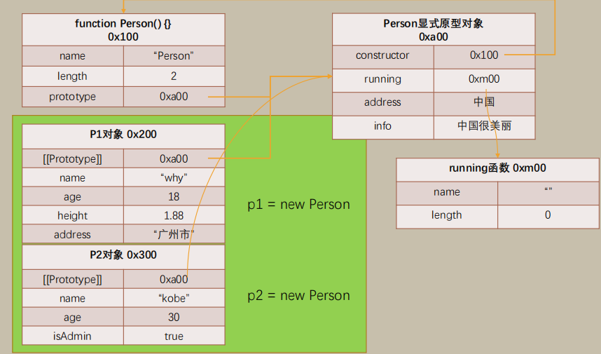
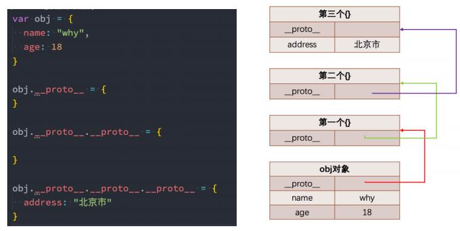
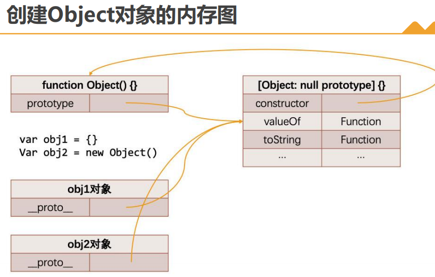
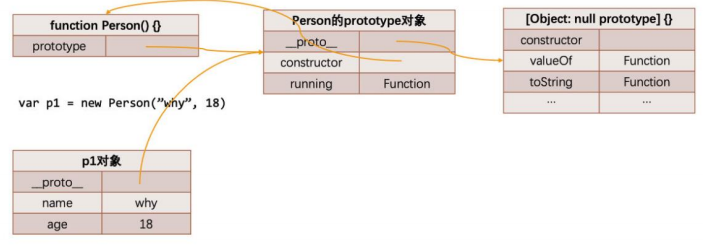
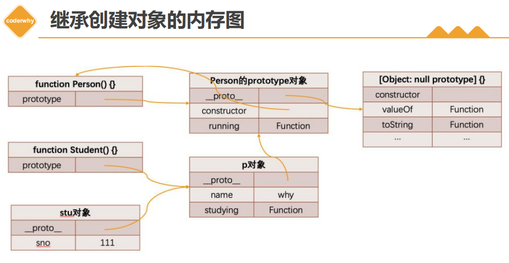

# 一. 对象原型和函数原型


## 对象的隐式原型 `[[prototype]]`

### 结论

> JS 中所有对象都有一个特殊的内置属性 `[[prototype]]`，这个属性的值称之为原型对象。

> 当读取对象自身不存在的属性时，将会去该对象的隐式原型对象身上查找该属性，若也不存在，则会沿原型链一层层往上查找，直到找到该属性或查找至原型链的终点 `null` 上也依然没有。

> 当写入对象自身不存在的属性时，将不会沿原型链去查找该属性，只会在当前对象上创建/修改。

### `[[Prototype]]` 是什么?

在 ECMAScript 规范中，每个对象都存在一个内部属性：

> `[[Prototype]]`=> 另一个对象 或 `null`

作用：
> 当访问对象的属性查找不到时，作为“下一跳”继续查找的目标对象。

⚠️ 注意：
> `[[Prototype]]` 是规范内部属性，不是普通 JS 属性，不能通过点运算符直接访问

### 获取与设置 `[[Prototype]]`

❌ 不推荐但存在的方式：`__proto__`
```js
obj.__proto__ // {constructor: ƒ, __defineGetter__: ƒ, __defineSetter__: ƒ,…}
```
说明：
> `[[prototype]]` 是一个内置属性，标准中是不可通过点运算符访问的，浏览器提供了通过 `__proto__` 方式获取对象的隐式原型。

> `__proto__` 是早期各大浏览器厂商自己实现的，并不是 ECMA 规范中明确规定的，浏览器厂商在实现 JS 的时候，为了兼容性，会实现这个属性，但是这个属性的语义和规范语义不一致，容易造成混乱。

> 使用 `__proto__` 是有争议的，语义混乱、性能差，不推荐在业务代码中使用。

> 为了兼容 Web 生态，`__proto__` 属性已在 `ES6` 语言规范中标准化，用于确保 Web 浏览器的兼容性。

> 现在更推荐使用[`Object.getPrototypeOf`](https://developer.mozilla.org/zh-CN/docs/Web/JavaScript/Reference/Global_Objects/Object/GetPrototypeOf)/[`Reflect.getPrototypeOf`](https://developer.mozilla.org/zh-CN/docs/Web/JavaScript/Reference/Global_Objects/Reflect/getPrototypeOf) 和[`Object.setPrototypeOf`](https://developer.mozilla.org/zh-CN/docs/Web/JavaScript/Reference/Global_Objects/Object/setPrototypeOf)/[`Reflect.setPrototypeOf`](https://developer.mozilla.org/zh-CN/docs/Web/JavaScript/Reference/Global_Objects/Reflect/setPrototypeOf)。

✅ 推荐方式（规范方法）
```js
Object.getPrototypeOf(obj) // {constructor: ƒ, __defineGetter__: ƒ, __defineSetter__: ƒ, …}
Reflect.getPrototypeOf(obj)

Object.setPrototypeOf(obj, proto)
Reflect.setPrototypeOf(obj, proto)

console.log(
  obj.__proto__ === Object.getPrototypeOf(obj)
) // true
```

⚠️ 性能提醒：
> 设置对象的 `[[Prototype]]` 是一个缓慢的操作，会导致性能问题，应尽量避免。

### 属性访问的查找流程

那么这个隐式原型对象有什么用呢？

> 当读取对象的属性时，会触发 `[[Get]]` 的操作。


示例：`obj.key`

`[[Get]]` 操作内部流程如下：
> 1. 查找 obj 自身是否存在 key
> 2. 不存在 → 查找 `obj.[[Prototype]]`
> 3. 仍不存在 → 继续沿原型链向上
> 4. 直到找到或 `[[Prototype]] === null`

这条查找路径被称为：原型链。

### 属性赋值不会“穿透”原型链

> 当写入对象自身不存在的属性时，将不会沿原型链去查找该属性，只会在当前对象上创建/修改。

```js
function Fruit() {} 
Fruit.sayHi = 'hi~'

function Fn() {}
Fn.prototype = Fruit

function Orange() {}
Orange.__proto__ = new Fn() // => Orange.__proto__ = Fn.prototype
// Object.setPrototypeOf(Orange, Fruit)
console.log(
  Orange.sayHi === Fruit.sayHi
) // true 这里 Orange.sayHi 是通过查找原型链找到的 Fruit 对象身上 sayHi 属性

// 下面的属性赋值，并不会通过原型链查找的方式找到 Fruit 对象身上的 sayHi 属性，而是作用在当前对象上
Orange.sayHi = 'hehe'

// 所以并不会影响到 Fruit 对象身上的 sayHi 方法，而是直接给 Orange 对象添加了一个 sayHi 属性
console.log(Fruit.sayHi)    // hi~
console.log(Orange.sayHi)   // hehe
```

✅ 结论总结：

> **读属性**：会沿原型链查找

> **写属性**：只会在当前对象上创建 / 修改

除非你直接拿到了**原型对象的引用**并修改它。


### 字面量对象也有原型吗？

答案：有的，**只要是对象都会有一个内部属性 `[[prototype]]`**。

```js
const obj = { name: 'later' }

Object.getPrototypeOf(obj) // Object.prototype
```
字面量对象的原型默认指向：
> `Object.prototype`


## 函数的显式原型 prototype

### 结论

> **所有的非箭头函数都有一个显式属性 prototype**

prototype 的唯一作用：
> 在函数作为构造函数使用时，用来赋值给新创建对象的隐式原型 `[[Prototype]]`

### prototype 是什么?

```js
function Foo() {}

Foo.prototype // { constructor: Foo }
```
关键点：
> prototype 不是原型链的一部分

> 它只是一个普通对象引用

> 真正参与属性查找的是：实例对象的 `[[Prototype]]`

### 构造函数创建对象时发生了什么

```js
const obj = new Foo()
```

内部等价步骤：
> 1. 创建一个新对象 obj
> 2. 设置：`obj.[[Prototype]] = Foo.prototype`
> 3. 执行：`Foo.call(obj)`
> 4. 返回 obj

所以：
```js
Object.getPrototypeOf(obj) === Foo.prototype // true
```

### 普通对象没有显式原型

```js
const obj = {}
obj.prototype // undefined
```
原因：
> `prototype` 是 **ECMAScript 规范赋予函数的特殊属性**

> 用于配合 `new` 操作符工作

> 普通对象**不参与对象创建流程**，自然不需要

### 箭头函数没有显式原型

```js
const fn = () => {}
fn.prototype // undefined
```

原因：
> 箭头函数不能作为构造函数使用。

为什么箭头函数不能作为构造函数使用？
> 箭头函数的 this 是绑定在创建时确定的（从作用域链中获取的），而不是在调用时确定的。

因此：
> 不需要 prototype

> 但作为对象，它仍然有 `[[Prototype]]`


# 二. new 操作符 与 constructor 属性


## new 与原型的联系

new 的完整执行步骤如下：

> 1. 在堆内存中创建一个新的空对象
> 2. 将构造函数的显式原型 `prototype` 属性赋值给新创建对象的隐式原型 `[[prototype]]` 属性
> 3. 将构造函数内部的 this 指向（绑定）该空对象
> 4. 执行构造函数中（函数体）的代码
> 5. 如果构造函数没有明确指定返回一个非空对象，则返回该创建出来的新对象

第二步才是 new 与原型机制产生联系的根源：

> **通过 new 创建的实例对象，它的 `[[prototype]]` 属性都指向构造函数的显式原型 `prototype` 属性。**

```js
function Person() {
  // 1. 创建一个空对象
  // 2. 将 Person.prototype 属性赋值给创建的对象的 [[prototype]] 内置属性
  // ...
}

var p1 = new Person()
var p2 = new Person()
console.log(p1.__proto__ === Person.prototype)  // true
console.log(p2.__proto__ === Person.prototype)  // true
console.log(p1.__proto__ === p2.__proto__)      // true
```
::: tip
> **同一个构造函数（类）创建的所有实例对象，都共享同一个原型对象。**
:::


## 公共方法挂在 prototype 上

### 重复创建方法的问题

```js
function Student(name) {
  this.name = name
  this.running = function () {} // 每次创建实例对象，都会新创建一个 running 方法对象
}
```
上述写法的问题是：
> 每创建一个实例，就创建一个新的函数对象

> 方法无法复用，占用不必要的内存

### 应该共享同一个方法

> 当我们创建多个实例对象，都有固定值的属性时, 可以将该属性挂载在构造函数的 prototype 属性上。

```js
function Student(name) {
  this.name = name
}

// 所有实例对象，都共享同一个 running 方法，节省堆内存
Student.prototype.running = function () {
  console.log(this.name + ' running~')
}

const stu1 = new Student('小明')
const stu2 = new Student('小红')

stu1.running() // 小明running~
stu2.running() // 小红running~
```

内部查找逻辑：

> 1. stu1.running → stu1 自身没有 
> 2. 查找 `stu1.[[Prototype]]` => `Student.prototype`
> 3. 找到 running，执行
> 4. 执行时 this 仍然指向调用者（stu1 / stu2）


## prototype.constructor

> 函数的 `prototype` 对象默认都有一个 `constructor` 属性，值指向函数自身。

```js
function Foo() {}
Foo.prototype.constructor                     // ƒ Foo() {}
Foo.prototype.constructor.name                // Foo
Foo.prototype.constructor === Foo             // true

var f1 = new Foo()
f1.constructor                                // f Foo() {}
f1.constructor.name                           // Foo
f1.constructor === Foo.prototype.constructor  // true
```


## 构造函数创建对象的内存表现

```js
function Person(name, age) {
  this.name = name
  this.age = age
}

Person.prototype.running = function() {}
Person.prototype.address = '中国'
Person.prototype.info = '中国很美丽'

var p1 = new Person('why', 18)
p1.height = 1.88
p1.address = '广州市'

var p2 = new Person('kobe', 30)
p2.isAdmin = true
```




## 重写 prototype 的隐含问题


### constructor 值混乱
> 当需要在原型上添加过多的属性，通常会重写整个原型对象：

```js
function Person() {}

Person.prototype = {
  name: 'later',
  age: 18,
  running() {
    console.log(this.name + '在吃东西')
  }
}
```

> 这里 `prototype` 指向了一个普通对象，但该对象本身不具备 `constructor` 属性

> 查找的时候会沿原型链找到 `Object.prototype.constructor`

> `constructor` 的值也就变成了 `Object` 构造函数，而不是 `Person` 构造函数了

###  正确修复 constructor 方式

> 如果希望 `constructor` 指向 `Person`，那么可以直接赋值：
```js
Person.prototype.constructor = Person
```

问题：
> 通过对象点语法的方式，直接给对象添加的属性，数据属性描述符默认都是设为 `true`。
> 
> 会造成 `constructor` 的 `[[Enumerable]]` 特性被设置成 `true`，`constructor` 变成 **可枚举**属性。

> 而原生的 `constructor` 属性默认是不可枚举的。

推荐方式：`Object.defineProperty`

```js
// 通过 属性描述符 定义一个属性时，
// 可配置、可写、可枚举等数据属性描述法默认设为 false，
// value 默认设为 undefined
Object.defineProperty(Person.prototype, 'constructor', {
  value: Person 
})
```
这样做的好处：
> 行为与默认 constructor 完全一致

> 不会污染枚举结果


# 三. 原型链的查找顺序

---

## 1. 面向对象的特性 - 继承

- 面向对象有三大特性：封装、继承、多态
  - 封装：我们前面将属性和方法封装到一个类中，可以称之为封装的过程
  - 继承：继承是面向对象中非常重要的，不仅仅可以减少重复代码的数量，也是多态前提（纯面向对象中）
  - 多态：不同的对象在执行时表现出不同的形态
- 那么这里我们核心讲继承，那么继承是做什么呢？
  -  继承可以帮助我们将重复的代码和逻辑抽取到父类中，子类只需要直接继承过来使用即可
  - 在很多编程语言中，继承也是多态的前提
- 那么`JS`当中如何实现继承呢？
  - 不着急，我们先来看一下`js`原型链的机制
  - 再利用原型链的机制实现一下继承

## 2. JS原型链

- 在真正实现继承之前，我们先来理解一个非常重要的概念：原型链

  - 我们知道，访问对象上的某个属性，如果该属性在当前对象中不存在就会去它的原型对象上面查找
  - 原型对象上面也没有该属性，就会去原型对象的原型对象上面查找，这就形成了一种链条结构，称之为原型链
  
  ```
  原型链：
  	每个对象都有自己的原型对象，原型对象也有自己的原型对象。
  	在访问对象的属性时，会沿着对象自身 => 自身的原型对象 => 原型对象的原型对象...这样的链条一路查找上去，这条链式结构就叫做原型链。
  	原型链的尽头是 Object的原型对象的[[prototype]]属性，值为null。
  ```
  
  

## 3. Object的原型

- 那么什么地方是原型链的尽头呢？

  ```js
  var obj = {
    name: 'later'
  }
  console.log(obj.__proto__.__proto__) // null
  ```

- 我们会发现它打印的是`null`，`node`环境中打印有时候会显示是 `[Object: null prototype] {}`

  - 事实上这个原型就是我们最顶层的原型了
  - 从`Object`直接创建出来的对象的原型都是` [Object: null prototype] {}`

- 那么我们可能会问题： `[Object: null prototype] {}`原型有什么特殊吗？

  - 特殊一：该对象有原型属性，但是它的原型属性已经指向的是`null`，也就是已经是顶层原型了
  - 特殊二：该对象上有很多默认的属性和方法

  

## 4. Object是所有类的父类

- 从我们上面的`Object`原型我们可以得出一个结论：**原型链最顶层的原型对象就是`Object`的原型对象**

```js
function Person(name, age) {
  this.name = name
  this.age = age
}
Person.prototype.running = function() {
  console.log(this.name + 'running~')
}

var p1 = new Person('why', 23)
console.log(p1) // Person {name: 'why', age: 23}
console.log(p1.valueOf()) // Person {name: 'why', age: 23}
console.log(p1.toString()) // [object Object]
```




# 四. 原型链实现的继承

---

## 1. 通过原型链实现继承

- 如果我们现在需要实现继承，那么就可以利用原型链来实现了：

  ```js
  // 1. 定义父类构造函数
  function Person() {
    this.name = 'why'
  }
  
  // 2. 父类原型上添加内容
  Person.prototype.running = function() {
    console.log(this.name + 'running~')
  }
  
  // 3. 定义子类构造函数
  function Student() {
    this.sno = 111
  }
  
  // 4. 创建父类对象，作为子类的原型对象
  var p = new Person()
  Student.prototype = p
  
  // 5. 在子类原型上添加内容
  Student.prototype.studying = function() {
    console.log(this.name + 'studying~')
  }
  ```
  
  - 目前`stu`的原型是`p`对象，而`p`对象的原型是`Person`默认的原型，里面包含`running`等函数
  - 注意：步骤4和步骤5不可以调整顺序，否则会有问题
  
  


# 五. 借用构造函数继承

---

## 1. 原型链继承的弊端

- 但是目前有一个很大的弊端：某些属性其实是保存在`p`对象上的
  - 第一，我们通过直接打印对象是看不到这个属性的
  - 第二，这个属性会被多个对象共享，如果这个对象是一个引用类型，那么就会造成问题
  - 第三，不能给`Person`传递参数（让每个`stu`有自己的属性），因为这个对象是一次性创建的（没办法定制化）

## 2. 借用构造函数继承

- 为了解决原型链继承中存在的问题，开发人员提供了一种新的技术: `constructor stealing`(有很多名称：借用构造函数或称之为经典继承或者称之为伪造对象)：

  - `steal`是偷窃、剽窃的意思，但是这里可以翻译成借用

- **借用构造函数继承的做法**非常简单：**在子类型构造函数的内部调用父类型构造函数**

  -  因为函数可以在任意的时刻被调用
  - 因此通过`apply()`和`call()`方法也可以在新创建的对象上执行构造函数

  ```js
  function Person(name, age) {
    this.name = name
    this.age = age
  }
  Person.prototype.running = function() {
    console.log(this.name + 'running~')
  }
  function Student(name, age) {
    Person.call(this, name, age)
  }
  
  var p1 = new Person()
  Student.prototype = p1
  
  var stu1 = new Student('later', 23)
  console.log(stu1) // Student {name: 'later', age: 23}
  stu1.running() // laterrunning~
  ```


# 六. 寄生组合实现继承

---

## 1. 组合借用继承的问题

- 组合继承是`JS`最常用的继承模式之一：

  - 如果你理解到这里，点到为止，那么组合来实现继承只能说问题不大
  - 但是它依然不是很完美，但是基本已经没有问题了

- 组合继承存在什么问题呢?

  - 组合继承最大的问题就是无论在什么情况下，都会调用两次父类构造函数

    - 一次在创建子类原型的时候

      ```js
      var p1 = new Person()
      ```

    - 另一次在子类构造函数内部(也就是每次创建子类实例的时候)

      ```js
      Person.call(this, name, age)
      ```

  - 另外，如果你仔细按照流程走了上面的每一个步骤，你会发现：所有的子类实例事实上会拥有两份父类的属性

    -  一份在当前的实例自己里面(也就是`person`本身的)，另一份在子类对应的原型对象中(也就是`Person.__proto__`里面)
    - 当然，这两份属性我们无需担心访问出现问题，因为默认一定是访问实例本身这一部分的

## 2. 原型式继承函数

- 原型式继承的渊源

  - 这种模式要从道格拉斯·克罗克福德（`Douglas Crockford`，著名的前端大师，`JSON`的创立者）在2006年写的一篇文章说起: `Prototypal Inheritance in JavaScript`（在`Javascirpt`中使用原型式继承) 
  - 在这篇文章中，它介绍了一种继承方法，而且这种继承方法不是通过构造函数来实现的
  - 为了理解这种方式，我们先再次回顾一下`js`想实现继承的目的：重复利用另外一个对象的属性和方法

- 最终的目的：`student`对象的原型指向了`person`对象

  ```js
  function Person(name, age) {
    this.name = name
    this.age = age
  }
  Person.prototype.running = function() {
    console.log(this.name + 'running~')
  }
  function Student(name, age) {
    Person.call(this, name, age) // 调用父类构造函数
  }
  // var p1 = new Person()
  // Student.prototype = p1
  function createObject(obj) {
    function Func() {}
    Func.prototype = obj
    return new Func()
    // Func.__proto__ = obj
    // return Func
    // 这里为什么不可以返回Func函数对象呢？因为如果返回Func函数对象，其本身是存在某些只读的内置属性，如name,length等，如果返回Func函数，在调用父类构造函数的时候，如果内部有对该对象的name或length属性进行操作时，可能就会查找到返回的Func函数的内置只读属性，会导致相关操作引发报错
  }
  Student.prototype = createObject(Person.prototype)
  
  var stu1 = new Student('later', 23)
  console.log(stu1) // Student {name: 'later', age: 23}
  stu1.running() // laterrunning~
  ```
  
  ```js
  // 方式一 兼容性最好
  function createObject(obj) {
    function Func() {}
    Func.prototype = obj
    return new Func()
  }
  // 方式二 性能不好
  function createObject(obj) {
    var newObj = {}
    // Object.setPrototypeOf(obj, prototype) 设置对象的原型
    // obj：要设置其原型的对象
    // prototype：该对象的新原型（一个对象或null）
    Object.setPrototypeOf(newObj, obj) // newObj.__proto__ = obj
    return newObj
  }
  // 方式三
  // Object.create()方法 创建一个新对象，使用指定提供的对象来作为新创建对象的原型__proto__
  Student.prototype = Object.create(Person.prototype)
  ```

## 3. 寄生式继承函数

- 寄生式（`Parasitic`）继承

  - 寄生式（`Parasitic`）继承是与原型式继承紧密相关的一种思想，并且同样由道格拉斯·克罗克福德（`Douglas Crockford`）提出和推广的
  - 寄生式继承的思路是**结合原型类继承和工厂模式的一种方式**
  - 即创建一个封装函数继承过程的函数，该函数在内部以某种方式来增强对象，最后再将这个对象返回

  ```js
  function object(obj) {
    function Func() {}
    Func.prototype = obj
    return new Func()
  }
  function createStudent(person) {
    var newObj = object(person)
    newObj.studying = function() {
      console.log(this.name + 'studying')
    }
    return newObj
  }
  ```

## 4. 寄生组合式继承

- 现在我们来回顾一下之前提出的比较理想的组合继承

  - **组合继承**是比较理想的继承方式，但是存在两个问题：
    - 问题一：**构造函数会被调用两次**：一次在创建子类型原型对象的时候，一次在创建子类型实例的时候
    - 问题二：**父类型中的属性会有两份**：一份在原型对象中，一份在子类型实例中

- 事实上突然，我们现在可以利用寄生式继承将这两个问题给解决掉：

  - 你需要先明确一点：当我们在子类型的构造函数中调用`父类型.call(this, 参数)`这个函数的时候，就会将父类型中的属性和方法复制一份到了子类型中，而父类型本身里面的内容，我们不再需要
  - 这个时候，我们还需要获取到一份父类型的原型对象中的属性和方法
  - 能不能直接让子类型的原型对象 = 父类型的原型对象呢?
  - 不要这么做，因为这么做意味着以后修改了子类型原型对象的某个引用类型的时候，父类型原生对象的引用类型也会被修改
  - 我们使用前面的寄生式思想就可以了

- **寄生组合继承的代码**

  ```js
  function object(obj) {
    function F() {}
    F.prototype = obj
    return new F()
  }
  
  function inheritPrototype(subType, superType) {
    // subType.prototype = object(superType.prototype) // es6之前早期写法, 无兼容性问题
    // subType.prototype.__proto__ = superType.prototype // __proto__不是早期ecma的标准(es6中标准化了)，浏览器实现的
    // Object.setPrototypeOf(subType.prototype, superType.prototype) // 直接修改对象的原型的操作都是有性能问题的
    subType.prototype = Object.create(superType.prototype) // 这个不错，创建一个新对象，指定其原型对象，无性能问题
    Object.defineProperty(subType.prototype, 'constructor', {
      enumerable: false,
      configurable: true,
      writable: true,
      value: superType
    })
    // 子类继承父类的类方法（兼容写法）
    Object.setPrototypeOf ? Object.setPrototypeOf(subType, superType) : subType.__proto__ = superType
  }
  
  inheritPrototype(Student, Person)
  ```
  


