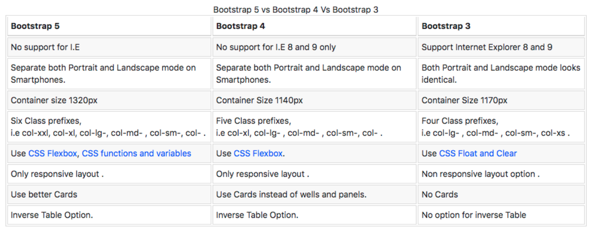
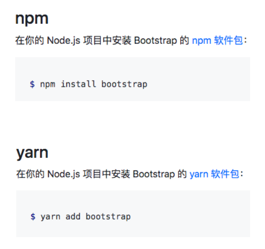
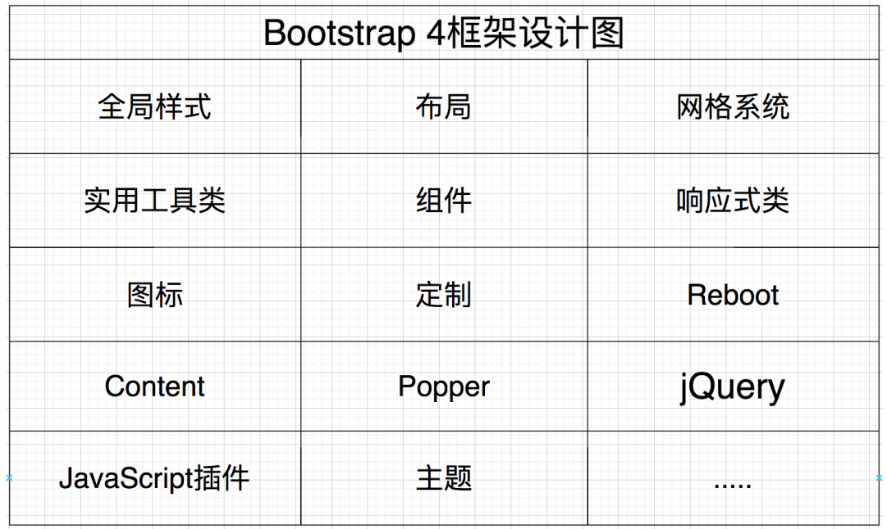
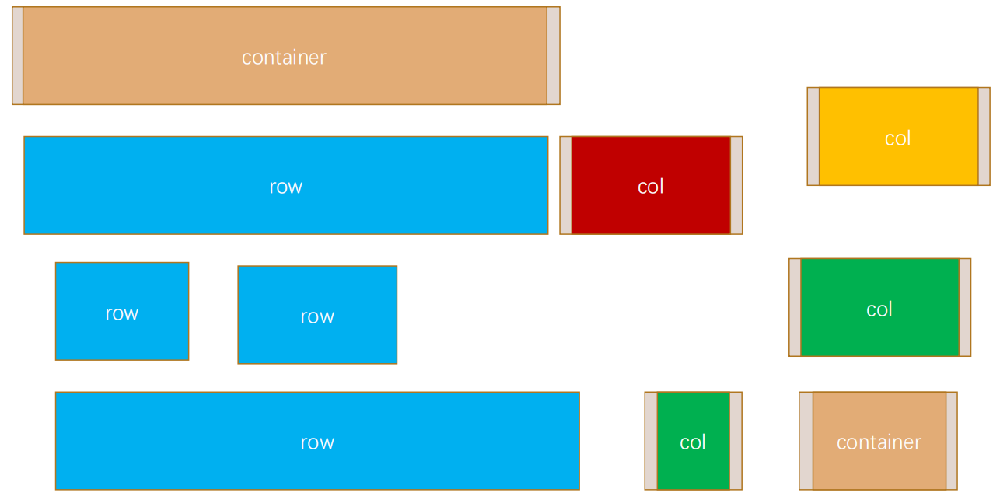
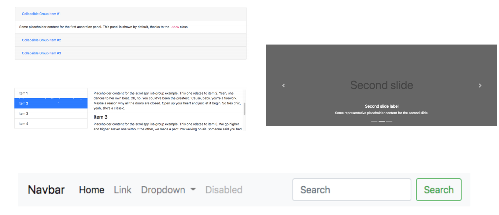

# 一. 认识`Bootstrap`

---

## 1.认识`Bootstrap`

- `Bootstrap `读音` /ˈbu:tstræp/ `，是一个非常受欢迎的前端框架，官方网站将其描述为
  - 最流行的` HTML、CSS `和` JS `框架，用于在` Web `上开发响应式、移动优先的项目。`(v3.x)`
    - 响应式页面：页面布局会随着屏幕尺寸的变化而自动调整布局，作用是适配各个屏幕
  - `Bootstrap`是功能强大、可扩展，且功能丰富的前端工具包。`（v5.x)`
  - `Bootstrap`底层是使用`Sass`构建，支持定制`（Sass、Color、CSS variable ....）`。`(v5.x)` 
  - `Bootstrap`中的网格系统、组件以及强大的`avaScript `插件可以让我们快速搭建响应式网站。`(v5.x)`
- 简单的理解
  - `Bootstrap`是由`HTML、CSS`和`JavaScript`编写可复用代码的集合（包括全局样式、组件、插件等），它是一个前端框架，使用该框架能够快速开发出响应的网站（即适配`PC`、平板和移动端的网站）
  - `Bootstrap`可以让我们免去编写大量的` CSS `代码（`Write less`），让我们更专注于网站业务逻辑的开发
  - `Bootstrap`是开源免费的，可以从`GitHub`直接拿到源码

## 2.`Bootstrap`起源和历史

- `Bootstrap`原名`Twitter Blueprint`，由`Twitter`公司的`Mark Otto`和`Jacob Thornton`编写
  - 他们的本意是想制作一套可以让网页保持统一风格的前端框架
- 在`Bootstrap`之前，`Twitter`团队在开发界面时，不同的项目组会使用不同的代码库
  - 这样就会很容易导致界面风格不一致等问题，从而增加了后期的维护成本
- `Mark Otto`发现自己设计的工具比别人设计的更强大，能够做更多的事情。几个月之后，`Mark Otto`和一群开发人员做出了`Bootstrap`的原型。然后经过他们开发小组几个月之后的努力，大家把`Twitter Blueprint`改名为`Bootstrap`
- 在2011年8月19日将其作为开源项目发布。项目由`Mark Otto、Jacob Thornton`和核心开发小组维护
- 在2012年1月31日发布`Bootstrap 2`，增加了十二列网格系统和响应式组件，并对许多组件进行了修改
- 在2013年8月19日发布`Bootstrap 3`，开始将移动设备优先作为方针，并且开始使用扁平化设计，支持`IE8-9`
- 在2018年1月7日发布`Bootstrap 4`，增加了`Flexbox Grid、Cards、Spacing Utilities`等
- 在2021年5月5日发布`Bootstrap 5`，增强`Grid System`、增强`Form elements、Not Support for IE、Bootstrap Icons`等

## 3.`Bootstrap3-5`版本的区别



## 4.`Bootstrap`优缺点

- `BootStrap`的优点
  - `Bootstrap`在`Web`开发人员中如此受欢迎的原因之一是它具有简单的文件结构，只需要懂`HTML、CSS 和 JS `的基本知识，就可以上手使用`Bootstrap`，甚至阅读其源码，对于初学者来是说易于学习
  - `Bootstrap`拥有一个强大的网格系统，它是由行和列组成，我们可以直接创建网格，无需自行编写媒体查询来创建
  - `Bootstrap`预定义很多响应式的类。例如，给图片添加`.img-responsive`类，图片将会根据用户的屏幕尺寸自动调整图像大小，更方便我们去做各个屏幕的适配。另外`Bootstrap `还提供了很多额外的工具类辅助我们进行网页开发
  - `Bootstrap`框架提供的组件、插件、布局、栅格系统、响应式工具等等，可以为我们节省了大量的开发时间
- `Bootstrap`的缺点
  - 不适合高度定制类型的项目，因为`Bootstrap`具有统一的视觉风格，高度定制类的项目需要大量的自定义和样式覆盖
  - `Bootstrap`的框架文件比较大(`61KB JS + 159KB CSS`)，资源文件过大会增加网站首屏加载的时间，并加重服务器的负担
  - `Bootstrap`样式相对笨重，也会额外添加一些不必要的`HTML`元素，会浪费一小部分浏览器的资源

## 5.学习`Bootstrap`的理由

- `Bootstrap`仍然是世界上使用较多的` CSS `框架。如果你以前没有学习过` CSS `框架，那么它将是一个很好的入门方式，`Bootstrap`它很容易上手，并且也有非常完整的中文文档
- `Bootstrap`提供的组件、插件、布局、栅格系统、响应式工具等，可以为我们节省了大量的开发时间，不必从零开始搭建页面
- `Bootstrap`框架可以为各个平台和浏览器提供一致的展示效果，例如在` Firefox `中与在` Chrome `中可以展示相同的效果
- `Bootstrap `提供开箱即用的响应式设计。因此，我们可以很快的开发出一套同时适配`PC、iPad`和移动端的网站
- `Bootstrap`使用` jQuery `与`HTML `交互。对于初学者来说，它将是一个不错的入门方式
- 同时`Bootstrap`框架优秀的设计和架构思想也是非常值得学习


# 二. `Bootstrap`安装

---

## 1.`Bootstrap4`的安装

- `Bootstrap`是一个前端框架
  - 该框架主要是由`CSS `和` JS`组成，但是也会依赖一小部分的`HTML`
  - 因此在安装`Bootstra`p时，我们需要引入相应的`CSS`和`JS`文件，当然也需要添加一些全局的配置
  - 在`Bootstrap 5 `版本以前，`Bootstrap`是依赖`jQuery`的
  - 那么如果使用的是`Bootstrap5`以下的版本，需在引入`Bootstrap`之前先引入`jQuery`库
- 下面我们来看看`Bootstrap `安装方式有哪些？
  - 方式一：在页面中，直接通过`CDN`的方式引
  - 方式二：下载`Bootstrap`框架，并在页面中手动引入
  - 方式三：使用`npm`包管理工具安装到项目中

## 2.方式一: `CDN`

- `Bootstrap`框架的`CDN`地址

  - `https://cdn.jsdelivr.net/npm/bootstrap@4.6.1/dist/css/bootstrap.min.css`
  - `https://cdn.jsdelivr.net/npm/jquery@3.5.1/dist/jquery.slim.min.js`
  - `https://cdn.jsdelivr.net/npm/bootstrap@4.6.1/dist/js/bootstrap.bundle.min.js`

- `HTML`中引入之后，添加重要的全局配置

  - `HTML5 `文档类型（`doctype `或 `DOCTYPE`），`Bootstrap `要求文档类型（`doctype`）是` HTML5`

    - 如果没有设置这个，就会看到一些古怪的、不完整的样式，因此，正确设置文档类型（`doctype`）能轻松避免这些困扰

  - 添加视口（`viewport`）

    - `Bootstrap `采用的是移动设备优先（`mobile first`） 的开发策略，为了网页能够适配移动端的设备，需在` <head> `标签中添加`viewport`（视口）

    - 在移动端会把` layout viewport `的宽度设置为设备的宽，并且不允许用户进行页面的缩放

    - ```html
          <meta name="viewport" content="width=device-width, initial-scale=1.0,user-scalable=no,maximum-scale=1.0,minimum-scale=1.0,shrink-to-fit=no">
      ```

## 3.方式二: 下载源码引入

- `Bootstrap`框架的下载
  - `Bootstrap`下载地址：`https://v4.bootcss.com/docs/getting-started/download/`
  - `jQuery`下载地址：`https://jquery.com/download/`
- 添加重要的全局配置
  - `HTML5 `文档类型（`doctype` 或 `DOCTYPE`），`Bootstrap `要求文档类型（`doctype`）是 `HTML5`
  - 添加视口`viewport`（`shrink-to-fit `是为了兼容 `Safari 9 `以后版本，禁止页面的伸缩)
  - `integrity`: 防止资源被篡改，篡改了将不加载；`crossorigin`：加载不同源的资源时，是否需要需带用户凭证（`cookie`，证书）

## 4.`Bootstrap`软件包内容


## 5.方式三: `npm`安装



## 6.`Bootstrap`初体验

- 需求：开发两个按钮，一个天空蓝的按钮和一个橙色的按钮

- 下面将使用两种方式实现：

  - 自己用`CSS`来开发

  ```html
    <link rel="stylesheet" href="./libs/bootstrap.css">
    
    <div class="btn btn-cirlce btn-primary">按钮1</div>
    <div class="btn btn-cirlce btn-warning">按钮2</div>
    <div class="btn btn-cirlce btn-default">按钮2</div>
  ```

  - 直接使用`Bootstrap`框架

  ```html
     <!-- 引入 Bootstarp中的CSS文件 -->
    <link rel="stylesheet" href="../libs/bootstrap-4.6.1/css/bootstrap.css">
  
    <div class="btn btn-primary">按钮1</div>
    <div class="btn btn-warning">按钮2</div>
    <button class="btn btn-info">按钮3</button>
  
    <button type="button" class="btn btn-primary">Primary</button>
    <button type="button" class="btn btn-secondary">Secondary</button>
    <button type="button" class="btn btn-success">Success</button>
    <button type="button" class="btn btn-danger">Danger</button>
    <button type="button" class="btn btn-warning">Warning</button>
    <button type="button" class="btn btn-info">Info</button>
    <button type="button" class="btn btn-light">Light</button>
    <button type="button" class="btn btn-dark">Dark</button>
  
    <button type="button" class="btn btn-link">Link</button>
  
    <script src="../libs/jquery/jquery-3.6.0.js"></script>
    <script src="../libs/bootstrap-4.6.1/js/bootstrap.bundle.js"></script>
  ```

## 7.`Bootstrap4 `框架设计图




# 三. 响应式容器原理

---

## 1.屏幕尺寸的分割点（`Breakpoints`）

- `Bootstrap`的一大核心就是响应式，即开发一套系统便可以适配不同尺寸的屏幕。它底层原理是使用媒体查询来为我们的布局和页面创建合理的断点(`Breakpoints`)，然后根据这些合理的断点来给不同尺寸屏幕应用不同的`CSS`样式
- `Bootstrap 4`设了`5`个断点来构建响应式系统，`5`个断点分别为` Extra-Small、Small、Medium、Large、Extra large`
- 媒体查询是`CSS`的一项功能，它允许你根据浏览器的分辨率来应用不同的`CSS`样式，如` @media (min-width: 576px){}`


## 2.响应式容器`Containers`

- `Containers`容器是` Bootstrap`中最基本的布局元素，并且该布局支持响应式。在使用默认网格系统时是必需的

- `Containers`容器用于包含、填充，有时也会作为内容居中使用。容器也是可以嵌套，但大多数布局不需要嵌套容器

- `Bootstrap `带有三个不同的`Containers`容器：

  - `.container`: 它在每个断点处会设置不同的`max-width`
  - `.container-fluid`：在所有断点处都是` width: 100%`
  - `.container-{breakpoint}`, 默认是`width: 100%`，直到指定断点才会修改为响应的值

- 每个`box`都是`border-box`

  


# 四. 网格系统的原理

---

## 1.认识网格系统（`Grid system`）

- 在我们在开发一个页面时，经常会遇到一些列表（例如，商品列表），这些列表通常都是通过行和列来排版
  - 对于这种列表我们可以使用`float`来实现，也可以使用`flexbox`布局实现
  - 为了方便我们对这种常见列表的布局，`Bootstrap`框架对它进行了封装，封装为一个网格系统（`Grid system`）
- 那什么是网格系统？
  - `Bootstrap`网格系统是用于构建移动设备优先的强大布局系统，可支持`12`列网格、`5`个断点和数十个预定义类
  - 提供了一种简单而强大的方法来创建各种形状和大小的响应式布局
  - 底层使用了强大的`flexbox`来构建弹性布局，并支持`12`列的网格布局
  - 网格系统是使用`container`、`row`和`col`类来布局，并且布局是支持响应的
- 那么我们应该如何使用网格系统？
  - 1.编写一个`container`或`container-fluid`容器
  - 2.在`container`容器中编写`row`容器
  - 3.在`row`容器中编写列`col`容器
- 下面我们通过一个需求来认识一下网格系统：如，使用Boostrap来实现一行3列的布局

```html
  <!--  初体验网格系统,属于自动列的宽 -->
   <div class="container">
     <div class="row">
       <div class="col item">1</div>
       <div class="col item">2</div>
       <div class="col item">3</div>
     </div>
   </div>

   <!-- 网格系统(启用了12列,超出12列就会换行)可以制定列的框 -->
   <div class="container">
      <div class="row">
        <div class="col-4 item">1</div>
        <div class="col-4 item">2</div>
        <div class="col-4 item">3</div>
        <div class="col-6 item">4</div>
      </div>
   </div>
```

## 2.`12`列网格系统（`12-Column Grid system`）

- 从`Bootstrap2`开始，网格系统从`16`列转向`12`列网格，原因之一是`12`列比以前的`16`列系统更灵活
- 将一个容器(`row`)被划分为`12`列网格，具有更广泛的应用，因为`12`可以被` 12、6、4、3、2、1`整除，而`16`列网格只能被`16、8、4、2、1`整除，所以`12`列网格能够在一行中表示更多种列数组合情况
- `12`列网格这意味着我们可将一行分解为`12、6、4、3、2`和`1`份:
  - `1`列，独占`12`等份
  - `2`列，每列占`6`等份
  - `3`列，每列占`4`等份
  - `4`列，每列占`3`等份
  - `6`列，每列占`2`等份
  - `12`列，每列占`1`等份

- `16`列网格一行分解为`16、8、4、2`和`1`份（添加`3`列需要添加额外的`css`）

## 3.网格系统的原理

- 网格系统是有`container、row、col`三部分组成，底层使用`flexbox`来布局，并且支持`12`列网格布局
  - `container`或`container-fluid`是布局容器，网格系统中必用的容器（该容器也会应用在：内容居中或作为包含其它内容等）
    - `width: 100%` / 某个断点的宽; - 布局的宽
    - `padding-right: 15px`; - 让包含的内容不会靠在布局右边缘
    - `padding-left: 15px`; - 让包含的内容不会靠在布局左边缘
    - `margin-right: auto`; - 布局居中
    - `margin-left: auto`; - 布局居中
  - `row`是网格系统中的每一行，`row`是存放在`container`容器中，如果指定列宽，那么一行最多可以存放`12`列，超出列数会换行
    - `display: flex`; - 指定`row`为弹性布局（并支持`12`列网格布局）
    - `flex-wrap: wrap`; - 支持多行展示`flex item`
    - `margin-right: -15px`; - 抵消`container`右边`15px`的`padding`
    - `margin-left: -15px`; - 抵消`container`左边`15px`的`padding`
  - `col`是网格系统的每一列，`col`是存放在`row`容器中
    - `position: relative`; - 相对定位布局
    - `flex-grow: 1 / flex: 0 0 x%`; - 自动拉伸布局或占百分比
    - `max-width: 100% / max-width: x%`; - 最大的宽
    - `padding-right: 15px`; - 让包含内容不会靠右边缘
    - `padding-left: 15px`; - 让包含内容不会靠左边缘

## 4.网格系统-`row`的负外边距（`margin`）

- `Containers`容器
  - `Containers`容器(有3种)在设计的时候的左右是有`15px`的`padding`
  - 因为容器是用于包含任何内容，而不仅仅是存放网格行和列
  - 如果容器上没有`padding`，内容默认会靠在布局的边缘
- `row`行 
  - `Containers`容器在设计的时候有左右的内边距`padding`
  - `row`左右`-15px`的外边距`margin`，是用来抵消`container`容器`15px`内边距，实现`row`左右边缘和容器左右边缘对齐
  - 当网格系统在嵌套的时候（列也可以充当容器`container-fluid`来使用），`row`左右`-15px`的外边距(`margin`)，也可以刚好抵消掉`col`左右`15px`的内边距(`padding`)
    - 如果`row`没有负值来抵消的话，那么嵌套网格系统越多，那么左右两边会多个多余的`padding`


## 5.网格系统的原理



## 6.网格系统-嵌套(`nesting`)

- `Bootstrap`的网格系统是可以支持嵌套的，例如：

  - 我们可以在某个网格系统的某一列上继续嵌套一个网格系统
  - 当网格系统中的某一列嵌套一个网格系统的时候，嵌套的网络系统可以省略`container`容器
  - 因为网格系统中的`col`是可以充当一个`container-fluid`容器来使用（`col`的属性和`container-fluid`的属性基本一样）

- 下面我们来做一个案例**：** 

  - 用指定列宽(语法：`col-{number}`) 的方式来实现一行`8`列的布局

  ```html
     <!--  方式一 -->
     <div class="container">
      <!-- flex:列宽是自动拉伸 -->
      <div class="row">
        <div class="col item">1</div>
        <div class="col item">2</div>
        <div class="col item">3</div>
        <div class="col item">4</div>
        <div class="col item">5</div>
        <div class="col item">6</div>
        <div class="col item">7</div>
        <div class="col item">8</div>
      </div>
     </div>
  
     <!-- 方式二: 指定列宽 -->
     <div class="container">
      <div class="row">
        <div class="col-6 item">
          <!-- 嵌套网格系统( 嵌套的时候是可以省略container ) -->
          <div class="row">
             <div class="col-3 item">1</div>
             <div class="col-3 item">2</div>
             <div class="col-3 item">3</div>
             <div class="col-3 item">4</div>
          </div>
        </div>
        <div class="col-6 item">
          <!-- ( 嵌套的时候是可以省略container ) -->
          <div class="row">
            <div class="col-3 item">1</div>
            <div class="col-3 item">2</div>
            <div class="col-3 item">3</div>
            <div class="col-3 item">4</div>
          </div>
        </div>
      </div>
     </div>
  ```

## 7.网格系统-自动布局（`Auto-layout`）

- 自动布局列`col（auto layout）`
  - `col`: 等宽列（`Equal-width`） 
    - 底层是` flex-grow: 1, max-width: 100%`。该类网格系统仅用`flexbox`布局
  - `col-auto`: 列的宽为`auto(Variable width content)`
    - 底层是` flex: 0 0 auto; width: auto`
  - `col-{num}`: 指定某个列的宽（支持`12`列网格）
    - 底层是` flex: 0 0 x%，max-width: x%`

## 8.网格系统-响应式类（`Responsive Class`）

- `5`个断点(`Breakpoints`) 

  - `none(xs): <576px `
  - `sm: >=576px`
  - `md: >=768px`
  - `lg: >=992px`
  - `xl: >=1200px`

- 响应式列布局的类

  - `col-sm `: 默认` width:100%`，当屏幕`>=576px`该类启用（`flexbox`布局）, 启用：`flex-grow: 1，max-width: 100%`
  - `col-md`: 默认` width:100%`，当屏幕`>=768px`该类启用（`flexbox`布局），启用：`flex-grow: 1，max-width: 100%`
  - `col-lg `: 默认` width:100%`，当屏幕`>=992px`该类启用（`flexbox`布局），启用：`flex-grow: 1，max-width: 100%`
  - `col-xl `: 默认` width:100%`，当屏幕`>=1200px`该类启用（`flexbox`布局）, 启用：`flex-grow: 1，max-width: 100%` 
  - `col-sm-{num} `: 默认` width:100%`，当屏幕`>=576px`该类启用 (支持`12`列网格), 启用：`flex: 0 0 x%`
  - `col-md-{num} `: 默认` width:100%`，当屏幕`>=768px`该类启用 (支持`12`列网格), 启用：`flex: 0 0 x%` 
  - `col-lg-{num} `: 默认` width:100%`，当屏幕`>=992px`该类启用 (支持`12`列网格), 启用：`flex: 0 0 x%` 
  - `col-xl-{num} `: 默认` width:100%`，当屏幕`>=1200px`该类启用 (支持`12`列网格) , 启用：`flex: 0 0 x%`

- 需求：开发响应式列表

  - 在`xl`屏幕显示`6`列，在`lg`屏幕显示`4`列，在`md`屏幕显示`3`列，在`sm`屏幕显示`2`列，特小屏(`none`)显示`1`列

  ```html
    <!-- 网格系统 -->
    <div class="container">
      <div class="row">   
        <div class="col-12 col-sm-6 col-md-4 col-lg-3 col-xl-2 item">1</div>
        <div class="col-12 col-sm-6 col-md-4 col-lg-3 col-xl-2 item">2</div>
        <div class="col-12 col-sm-6 col-md-4 col-lg-3 col-xl-2 item">3</div>
        <div class="col-12 col-sm-6 col-md-4 col-lg-3 col-xl-2 item">4</div>
        <div class="col-12 col-sm-6 col-md-4 col-lg-3 col-xl-2 item">5</div>
        <div class="col-12 col-sm-6 col-md-4 col-lg-3 col-xl-2 item">6</div>
      </div>
    </div>
  ```


# 五. 响应式工具和组件

---

## 1.认识响应式工具类

- 当我们在开发响应式页面时，可能会有这样的需求：
  - 某个功能在`PC`端可见，但是在移动端不可见
  - 因为移动端的屏幕比较小，是不能把`PC`端中所有的内容都展示出来，所以有些不重要的内容可能在移动端就被简化了
  - 这时我们就可以借用响应式的工具来实现该功能
- `Bootstrap`的响应式工具类 - `Display`
  - 为了更快地进行多端的开发，我们可以使用`Bootstrap`提供的响应式工具类（`display`），该类可按设备显示和隐藏元素
  - 为了避免为同一个网站开发出多个不同的版本（`PC、iPad、iPhone`），我们可以针对每个屏幕尺寸响应地隐藏和显示元素，来实现在不同屏幕上显示不同的页面
- 如何使用响应工具类（`display`）? 
  - 隐藏元素可以给某个元素添加` .d-none `类或` .d-{sm,md,lg,xl,xxl}-none `类中的任何一个
  - 显示元素可以给某个元素添加` .d-block `类或` .d-{sm,md,lg,xl,xxl}-block `类中的任何一个

## 2.响应式工具类 - `Display`

- 需求：

  - 1.某个元素只在`lg(>=992px) `和` xl `屏显示
  - 2.某个元素只在`lg(>=992px) `和` xl `屏隐藏
  - 3.某个元素只在` md(>=768px) `屏隐藏

  ```html
    <!-- 1.某个元素只在lg(>=992px) 和 xl 屏显示 -->
    <h1 class="d-none d-lg-block">某个元素只在lg(>=992px) 和 xl 屏显示</h1>
    <!-- 2.某个元素只在lg(>=992px) 和 xl 屏隐藏 -->
    <h1 class="d-block d-lg-none">某个元素只在lg(>=992px) 和 xl 屏隐藏</h1>
    <!-- 3.某个元素只在 md(>=768px) 屏隐藏 -->
    <h1 class="d-block d-md-none d-lg-block">某个元素只在 md(>=768px) 屏隐藏</h1>
  ```


## 3.实用的工具类（`Utility classes`）

- 快速浮动（`Float`） 
  - `float-left`
  - `float-right`
- 文本（`Text`） 
  - `text-left、text-right、text-center`
  - `text-{sm、md、lg、xl}-left `
- 边框
  - `borde border-top border-left `
  - `border border-primary border-success`
- 截断文本
  - `text-truncate`


## 4.可访问性-辅助类（了解）

- 屏幕阅读器的适配（专门针对残障人士设备的适配）
  - `.sr-only`
    - `.sr-only `类可以对屏幕阅读器以外的设备隐藏内容，即对屏幕阅读辅助器可见
  - `.sr-only-focusable`
    - `.sr-only `和` .sr-only-focusable `联合使用的话可以在元素有焦点的时候再次显示出来（例如，使用键盘导航的用户）。对于需遵循可访问性的网站来说是很有必要的
- 增强可访问性的辅助类（针对残障人使用的设备的适配，同时增强语义化） 
  - `role=”xxx”`: 定义用户界面元素的类型，作用增强`Web`可访问性，使残障人士可以更好的使用`Web`内容
  - `aria-*=”xxx”`: 增强可访问性，当与`role=“xxx”`结合使用时，当元素的状态和属性发生变化时会触发辅助技术发出通知，并将信息传达给用户

## 5.`Bootstrap`组件



```html
  <h1>1.Brand</h1>
  <nav class="navbar navbar-dark bg-dark">
    <a class="navbar-brand" href="#">
      
    </a>
  </nav>

  <h1>2.Nav Link</h1>
  <nav class="navbar navbar-expand-lg navbar-light bg-light">
    <div class="container">
        <a class="navbar-brand" href="#">Brand</a>
        <button class="navbar-toggler" type="button" data-toggle="collapse" data-target="#navbarNav">
          <span class="navbar-toggler-icon"></span>
        </button>
        <div class="collapse navbar-collapse" id="navbarNav">
          <ul class="navbar-nav">
            <li class="nav-item active">
              <a class="nav-link" href="#">Home <span class="sr-only">(current)</span></a>
            </li>
            <li class="nav-item">
              <a class="nav-link" href="#">Features</a>
            </li>
            <li class="nav-item">
              <a class="nav-link" href="#">Pricing</a>
            </li>
            <li class="nav-item">
              <a class="nav-link disabled">Disabled</a>
            </li>
          </ul>
        </div>
    </div>
```


# 六. `Bootstarp`项目实战

---

- 适合做官网，多端适配的需求


