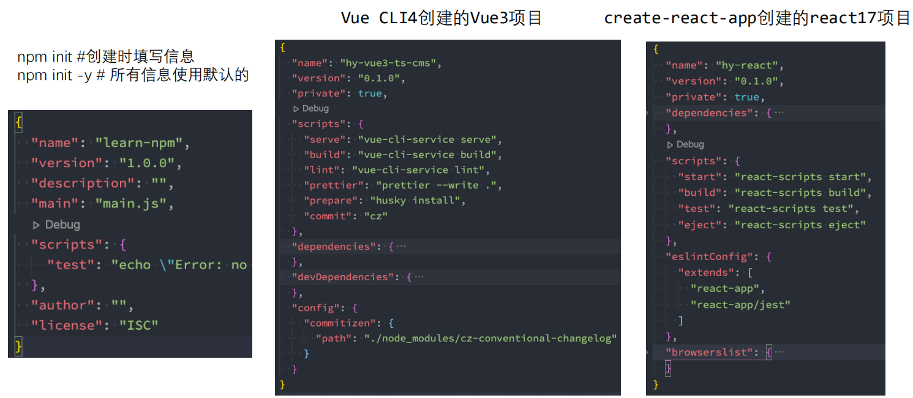
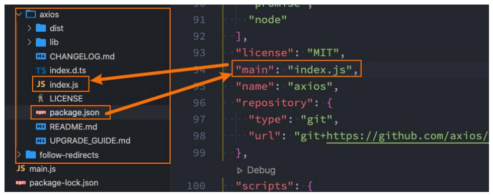
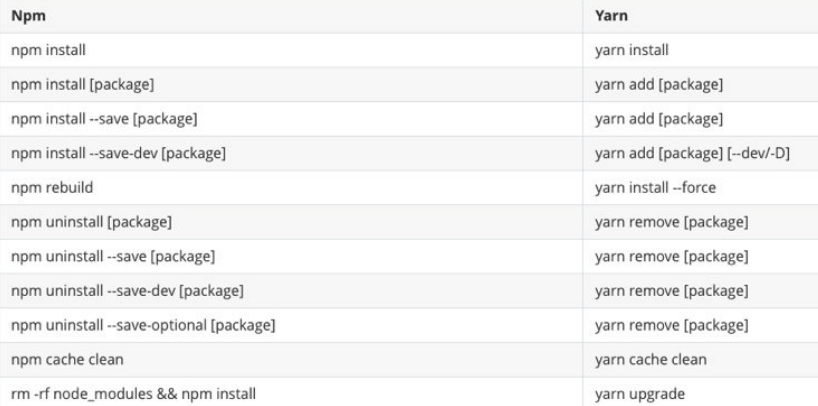
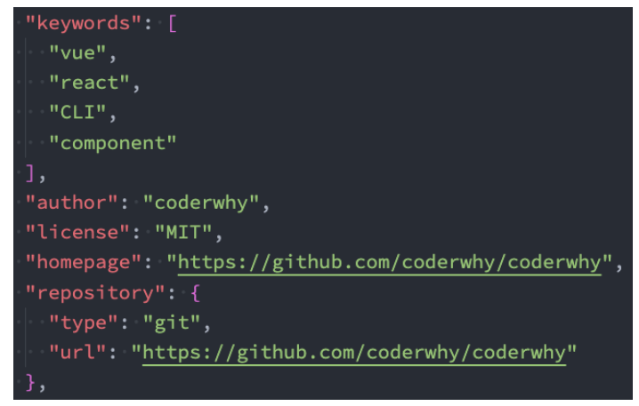
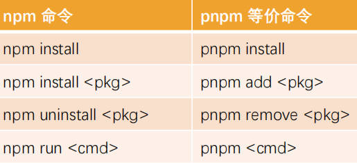

# 一. `npm`包管理工具

---

## 1.代码共享方案

- 我们已经学习了在`JavaScript`中可以通过模块化的方式将代码划分成一个个小的结构：
  - 在以后的开发中我们就可以通过模块化的方式来封装自己的代码，并且封装成一个工具
  - 这个工具我们可以让同事通过导入的方式来使用，甚至你可以分享给世界各地的程序员来使用
- 如果我们分享给世界上所有的程序员使用，有哪些方式呢？
- 方式一：**上传到`GitHub`上、其他程序员通过`GitHub`下载我们的代码手动的引用**
  - 缺点是大家必须知道你的代码`GitHub`的地址，并且从`GitHub`上手动下载
  - 需要在自己的项目中手动的引用，并且管理相关的依赖
  - 不需要使用的时候，需要手动来删除相关的依赖
  - 当遇到版本升级或者切换时，需要重复上面的操作
- 显然，上面的方式是有效的，但是这种传统的方式非常麻烦，并且容易出错
- 方式二：**使用一个专业的工具来管理我们的代码**
  - 我们通过工具将代码发布到特定的位置
  - 其他程序员直接通过工具来安装、升级、删除我们的工具代码
- 显然，通过第二种方式我们可以更好的管理自己的工具包，其他人也可以更好的使用我们的工具包

## 2.包管理工具`npm`

- 包管理工具npm： 
  - `Node Package Manager`，也就是`Node`包管理器
  - 但是目前已经不仅仅是`Node`包管理器了，在前端项目中我们也在使用它来管理依赖的包
  - 比如`vue、vue-router、vuex、express、koa、react、react-dom、axios、babel、webpack`等等
- 如何下载和安装`npm`工具呢？
  - **`npm`属于`node`的一个管理工具**，所以我们需要先安装`Node`
  - `node`管理工具：`https://nodejs.org/en/`，安装`Node`的过程会自动安装`npm`工具
- `npm`管理的包可以在哪里查看、搜索呢？
  - `https://www.npmjs.org/`
  - 这是我们安装相关的`npm`包的官网
- `npm`管理的包存放在哪里呢？
  - 我们发布自己的包其实是发布到`registry`上面的
  - 当我们安装一个包时其实是从`registry`上面下载的包

## 3.`npm`的配置文件

- 那么对于一个项目来说，我们如何使用`npm`来管理这么多包呢？
  - 事实上，我们每一个项目都会有一个对应的配置文件，无论是前端项目（`Vue、React`）还是后端项目（`Node`）
  - **这个配置文件会记录着你项目的名称、版本号、项目描述等**
  - **也会记录着该项目所依赖的其他库的信息和依赖库的版本号**
- 这个配置文件就是`package.json`
- 那么这个配置文件如何得到呢？
  - 方式一：手动从零创建项目:`npm init`，快速创建项目及默认配置:`npm init –y `
  - 方式二：通过脚手架创建项目，脚手架会帮助我们生成`package.json`，并且里面有相关的配置


# 二. `package`配置文件

---

## 1.常见的配置文件



## 2.常见的属性

- 必须填写的属性：`name`、`version`

  - `name`是项目的名称
  - `version`是当前项目的版本号
  - `description`是描述信息，很多时候是作为项目的基本描述
  - `author`是作者相关信息（发布时用到）
  - `license`是开源协议（发布时用到）

- `private`属性：

  - `private`属性记录当前的项目是否是私有的
  - 当值为`true`时，`npm`是不能发布它的，这是防止私有项目或模块发布出去的方式

- `main`属性：

  - 设置程序的入口
  - 比如我们使用`axios`模块 `const axios = require('axios')`
  - 如果有`main`属性，实际上是根据`main`属性查找对应的文件的，不设置该属性，默认是查找`index.js`

  

- `scripts`属性
  - `scripts`属性用于配置一些脚本命令，以键值对的形式存在
  - 配置后我们可以通过`npm run`命令的`key`来执行这个命令
  - `npm start`和`npm run start`的区别是什么？
    - 它们是等价的
    - 对于常用的`start、 test、stop、restart`可以省略掉`run`直接通过`npm start`等方式运行
- `dependencies`属性
  - `dependencies`属性是指定**无论开发环境还是生成环境都需要依赖的包**
    - 通常是我们项目实际开发用到的一些库模块`vue、vuex、vue-router、react、react-dom、axios`等等
    - 与之对应的是`devDependencies`
- `devDependencies`属性
  - 一些包在生成环境是不需要的，比如`webpack、babel`等
  - 这个时候我们会通过`npm install webpack --save-dev`(简写:`-D`)，将它安装到`devDependencies`属性中
- `peerDependencies`属性
  - 还有一种项目依赖关系是对等依赖，也就是你依赖的一个包，它必须是以另外一个宿主包为前提的
  - 比如`element-plus`是依赖于`vue3`的，`ant design`是依赖于`react、react-dom`

## 3.依赖的版本管理

- 我们会发现安装的依赖版本出现：`^2.0.3`或`~2.0.3`，这是什么意思呢？
- **`npm`的包通常需要遵从`semver`版本规范**:
  - `semver`：`https://semver.org/lang/zh-CN/`
  - `npm semver`：`https://docs.npmjs.com/misc/semver`
- `semver`版本规范是`X.Y.Z`：:
  - `X`主版本号（`major`）：当你做了不兼容的`API`修改（可能不兼容之前的版本）
  - `Y`次版本号（`minor`）：当你做了向下兼容的功能性新增（新功能增加，但是兼容之前的版本）
  - `Z`修订号（`patch`）：当你做了向下兼容的问题修正（没有新功能，修复了之前版本的`bug`）
- 我们这里解释一下`^`和`~`的区别：
  - `x.y.z`：表示一个明确的版本号
  - `^x.y.z`：表示`x`是保持不变的，`y`和`z`永远安装最新的版本(`x`不变，`yz`最新)
  - `~x.y.z`：表示`x`和`y`保持不变的，`z`永远安装最新的版本(`xy`不变，`z`最新)

## 4.常见属性

- `engines`属性
  - `engines`属性用于指定`Node`和`NPM`的版本号
  - 在安装的过程中，会先检查对应的引擎版本，如果不符合就会报错
  - 事实上也可以指定所在的操作系统`"os" : [ "darwin", "linux" ]`，只是很少用到
- `browserslist`属性
  - 用于配置打包后的`JavaScript`浏览器的兼容情况，参考
  - 否则我们需要手动的添加`polyfills`来让支持某些语法
  - 也就是说它是为`webpack`等打包工具服务的一个属性（这里不是详细讲解`webpack`等工具的工作原理，所以不再给出详情）

## 5.`npm install `命令

- 安装`npm`包分两种情况：

  - 全局安装(`global install`)：`npm install webpack -g`，安装到node中一个配置环境变量的文件中
  - 项目(局部)安装(`local install`)：`npm install webpack`

- 全局安装

  - 全局安装是直接将某个包安装到全局：

  - 比如全局安装`yarn`：

    `npm install yarn -g` 

- 但是很多人对全局安装有一些误会：

  - 通常使用`npm`全局安装的包都是一些工具包：`yarn`、`webpack`等
  - 并不是类似于`axios`、`express`、`koa`等库文件
  - 所以全局安装了之后并不能让我们在所有的项目中使用`axios`等库

## 6.项目安装

- 项目安装会在当前目录下生成一个`node_modules`文件夹，我们之前讲解`require`查找顺序时有讲解过这个包在什么情况下被查找

- 局部安装分为开发时依赖和生产时依赖：

  ```js
      // 默认安装开发和生产依赖
      npm install axios
      npm i axios
  
      // 只安装开发依赖
      npm install webpack --save-dev
      npm install webpack -D
      npm i webpack –D 
  
      // 根据package.json中的依赖包安装
      npm install
  ```

  


# 三. `npm install`原理

---

## 1.`package-lock.json`

- `package-lock.json`文件解析：

  - `name`：项目的名称
  - `version`：项目的版本
  - `lockfileVersion`：`lock`文件的版本
  - `requires`：使用`requires`来跟踪模块的依赖关系
  - `dependencies`：项目的依赖
    - 当前项目依赖`axios`，但是`axios`依赖`follow-redireacts`
    - `axios`中的属性如下：
      - `version`表示实际安装的`axios`的版本
      - `resolved`用来记录下载的地址，`registry`仓库中的位置
      - `requires / dependencies`记录当前模块的依赖
      - `integrity`用来从缓存中获取索引，再通过索引去获取压缩包文件(其他项目再去安装这个包时，根据缓存中的索引去查找压缩包，找不到再去`registry`仓库中下载下来压缩包，然后先缓存起来，同时更新`integrity`)

  

## 2.`npm install`原理图

- 很多同学之前应该已经会了`npm install <package>`，但是你是否思考过它的内部原理呢？

  - 执行`npm install`它背后帮助我们完成了什么操作？ 
  - 我们会发现还有一个称之为`package-lock.json`的文件，它的作用是什么？
  - 从`npm5`开始，`npm`支持缓存策略（来自`yarn`的压力），缓存有什么作用呢？

- 这是一幅根据`npm install`的原理图:

  

## 3.`npm install`原理图解析

- `npm install`会检测是否存在`package-lock.json`文件:
  - 没有`lock`文件
    - 分析依赖关系，这是因为我们可能包会依赖其他的包，并且多个包之间会产生相同依赖的情况
    - 从`registry`仓库中下载压缩包（如果我们设置了镜像，那么会从镜像服务器下载压缩包）
    - 获取到压缩包后会对压缩包进行缓存（从`npm5`开始有的）
    - 将压缩包解压到项目的`node_modules`文件夹中（前面我们讲过，`require`的查找顺序会在该包下面查找）
  - 有`lock`文件
    - 检测`lock`中包的版本是否和`package.json`中一致（会按照`semver`版本规范检测）
    - 不一致，那么会重新构建依赖关系，直接会走顶层的流程
    - 一致的情况下，会去优先查找缓存
    - 没有找到，会从`registry`仓库下载，直接走顶层流程
    - 查找到，会获取缓存中的压缩文件，并且将压缩文件解压到`node_modules`文件夹中

## 4.`npm`其他命令

- 我们这里再介绍几个比较常用的：

  - 卸载某个依赖包：

    ```js
        npm uninstall package
        npm uninstall package --save-dev
        npm uninstall package -D
    ```

  - 强制重新`build`

    ```js
    	npm rubuild
    ```

  - 清除缓存

    ```js
    	npm cache clean // 一般运行都是会报错，提示npm5会自动修复缓存啥的，不建议删除npm，如果想强制删除的话使用：npm cache clean --force
    ```

  - 查看缓存文件地址

    ```js
    	npm config get cache
    ```

- `npm`的命令其实是非常多的：

  - `https://docs.npmjs.com/cli-documentation/cli`
  - 更多的命令，可以根据需要查阅官方文档


# 四. `yarn`、`cnpm`、`npx`

---

## 1.`yarn`工具

- 另一个`node`包管理工具`yarn`： 

  - `yarn`是由`Facebook、Google、Exponent `和` Tilde `联合推出了一个新的` JS `包管理工具
  - `yarn`是为了弥补早期`npm `的一些缺陷而出现的
  - 早期的`npm`存在很多的缺陷，比如安装依赖速度很慢、版本依赖混乱等等一系列的问题
  - 虽然从`npm5`版本开始，进行了很多的升级和改进，但是依然很多人喜欢使用`yarn`

- 注意：

  - 安装`yarn`：`npm install yarn -g`，`yarn`本身也是一个`npm`包，而且一般作为工具使用全局安装
  - 初始化默认配置项目：`yarn init -y`
  - 有`package.json`文件的话，可以省略`install`，直接`yarn`即可安装依赖

  

## 2.`cnpm`工具

- 由于一些特殊的原因，某些情况下我们没办法很好的从`https://registry.npmjs.org`下载下来一些需要的包

- 查看`npm`镜像：

  ```js
      npm config get registry # npm config get registry
  ```

- 我们可以直接设置`npm`的镜像：

  ```js
      npm config set registry https://registry.npm.taobao.org
  ```

- 但是对于大多数人来说（比如我），并不希望将`npm`镜像修改了：

  - 第一，不太希望随意修改`npm`原本从官方下来包的渠道
  - 第二，担心某天淘宝的镜像挂了或者不维护了，又要改来改去

- 这个时候，我们可以使用`cnpm`，并且将`cnpm`设置为淘宝的镜像：`cnpm`工具

  ```bash
  npm install -g cnpm --registry=https://registry.npm.taobao.org
  # 等价于上面
  # npm install cnpm -g 
  # cnpm set registry=https://registry.npm.taobao.org
  cnpm config get registry # https://r.npm.taobao.org
  ```

## 3.`npx`工具

- **`npx`是`npm5.2`之后自带的一个命令**
  - `npx`的作用非常多，但是比较常见的是使用它来调用项目中的某个模块的指令
- 我们以`webpack`为例：
  - 全局安装的是`webpack5.1.3`
  - 项目安装的是`webpack3.6.0`
- 如果我在终端执行` webpack --version`使用的是哪一个命令呢？
  - 显示结果会是` webpack 5.1.3`，事实上使用的是全局的，为什么呢？
  - 原因非常简单，在当前目录下找不到`webpack`时，就会去全局找，并且执行命令
  - **`window`操作系统中，查找命令优先在当前目录中查找，不会去子目录下查找，如果当前目录没有查找到就会去全局的环境变量中查找，而环境变量中添加的是全局的版本**
- 如何解决这个问题呢？

## 4.局部命令的执行

- 那么如何使用项目(局部)的`webpack`，常见的是两种方式：

  - 方式一：明确查找到`node_module/.bin目录`下的`webpack`

  - 方式二：在`scripts`定义脚本，来执行`webpack`

    - 方式一：在终端中使用如下命令（在项目根目录下）

      ```bash
      # window 需cd到.bin目录里，再执行相应的命令
      ./node_modules/.bin/webpack --version
      ```
    
    - 方式二：修改`package.json`中的`scripts`
    
      - 注意：**`package.json`中的`scripts`里执行某个命令，这里执行的命令优先在当前的`node_modules/.bin`目录下找对应的命令，如果没有再去全局环境变量中查找**，所以这里是**可以省略`npx`**
    
      ```json
      "scripts": {
        "webpack": "webpack --version" // "npx webpack --version"
      }
      ```
    
    - 方式三：使用`npx`
    
      ```js
          npx webpack --version
      ```

- **`npx`的原理**非常简单，它会**到当前目录的`node_modules/.bin`目录下查找对应的命令**

- 注意：

  - **`webpack`本身有做特殊处理，会去当前目录下的子目录中查找对应的命令，其他的插件工具一般是不会做这种处理的**


# 五. 发布自己的开发包

---

- 注册`npm`账号：

  - `https://www.npmjs.com/`

- 在命令行登录：

  ```js
      npm login
  ```

- 修改`package.json`

- 发布到`npm registry`上

  ```js
      npm publish
  ```

- 更新仓库：

  - 1.修改版本号(最好符合`semver`规范) 
  - 2.重新发布

- 删除发布的包：

  ```js
      npm unpublish
  ```

- 让发布的包过期

  ```js
      npm deprecate
  ```




# 六. `pnpm`使用和原理

---

## 1.什么是pnpm呢？

- 什么是`pnpm`呢？我们来看一下官方的解释：

  - `pnpm`：我们可以理解成是`performant npm`缩写

  

- 哪些公司在用呢？

  - 包括`Vue`在内的很多公司或者开源项目的包管理工具都切换到了`pnpm`

  

## 2.硬链接和软连接的概念

- **硬链接**(`hard link`):

  - 硬链接(英语：`hard link`)是电脑文件系统中的**多个文件平等地共享同一个文件存储单元**
  - 删除一个文件名字后，还可以用其它名字继续访问该文件

- **符号链接**(软链接`soft link、Symbolic link`)：

  - 符号链接（**软链接**、`Symbolic link`）是一类特殊的文件
  - 其包含有一条以绝对路径或者相对路径的形式指向其它文件或者目录的**引用**（**快捷方式就是软链接的体现**）

  

## 3.硬链接和软连接的演练

- 文件的拷贝：文件的拷贝每个人都非常熟悉，会在硬盘中复制出来一份新的文件数据

  ```js
      window: copy foo.js foo_copy.js
      macos : cp foo.js foo_copy.js
  ```

  

- 文件的硬链接

  ```js
      window: mklink /H aaa_hard.js aaa.js
      macos : ln foo.js foo_hard.js
  ```

  

- 文件的软连接：

  ```js
      window: mklink aaa_soft.js aaa.js
      macos : ln -s foo.js foo_copy.js
  ```

  

## 4.pnpm到底做了什么呢？

- 当使用`npm`或`yarn`时，如果你有100个项目，并且所有项目都有一个相同的依赖包，那么，在你的硬盘上就需要保存100份该相同依赖包的副本
- 如果是使用`pnpm`，依赖包将被存放在一个统一的位置，因此：
  - 如果你**对同一依赖包使用相同的版本**，那么磁盘上**只有这个依赖包的一份文件**
  - 如果你**对同一依赖包需要使用不同的版本**，则仅有**版本之间不同的文件会被存储起来**
  - **所有文件都保存在硬盘上的统一的位置**： 
    - 当安装软件包时，其包含的**所有文件都会硬链接到此位置，而不会占用额外的硬盘空间**
    - 这让你可以**在多个项目之间方便地共享相同版本的依赖包**


## 2.pnpm创建非扁平的node_modules目录

- 当使用`npm`或`Yarn Classic`安装依赖包时，所有软件包都将被提升到`node_modules`的根目录下

  - 其结果是，源码可以访问 本不属于当前项目所设定的依赖包

  

## 3.`pnpm`的安装和使用

- 那么我们应该如何安装`pnpm`呢？

  - 官网提供了很多种方式来安装：`https://pnpm.io/zh/`

  - 因为我们每个同学都要求安装过`Node`，`Node`中有`npm`，所以我们通过`npm`安装即可

    ```js
    	npm i pnpm -g
    ```

- 以下 是一个与`npm`等价命令的对照表，帮助你快速入门：



- 更多命令和用法可以参考`pnpm`的官网：`https://pnpm.io/zh/`

## 4.`pnpm`的存储`store`

- 在`pnpm7.0`之前，统一的存储位置是`~/.pnpm-score`中的

  

- 在`pnpm7.0`之后，统一的存储位置进行了更改：`<pnpm home directory>/store`

  - 在`Linux`上，默认是`~/.local/share/pnpm/store`
  - 在`Windows`上：`%LOCALAPPDATA%/pnpm/store`
  - 在`macOS`上： `~/Library/pnpm/store`

  

- 我们可以通过一些终端命令获取这个目录：获取当前活跃的`store`目录

  ```bash
  pnpm store path
  ```

- 另外一个非常重要的`store`命令是`prune`(修剪)：从`store`中删除当前未被引用的包来释放`store`的空间

  ```bash
  pnpm store prune
  ```

- 根据`.pnpm-store/store`等文件来建立硬链接，但是不能跨磁盘建立链接
