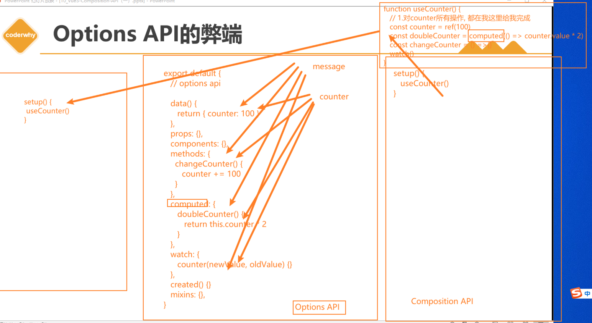
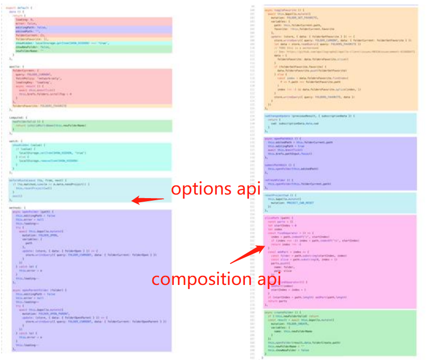
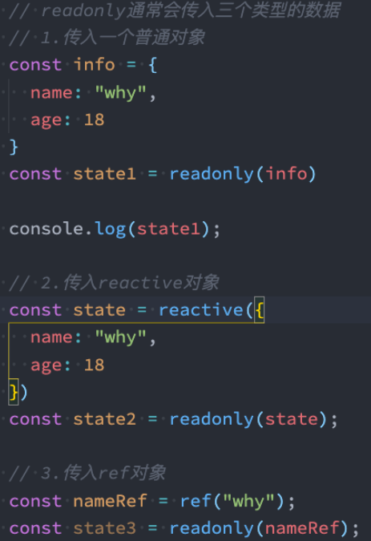
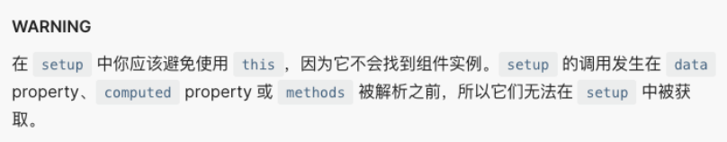
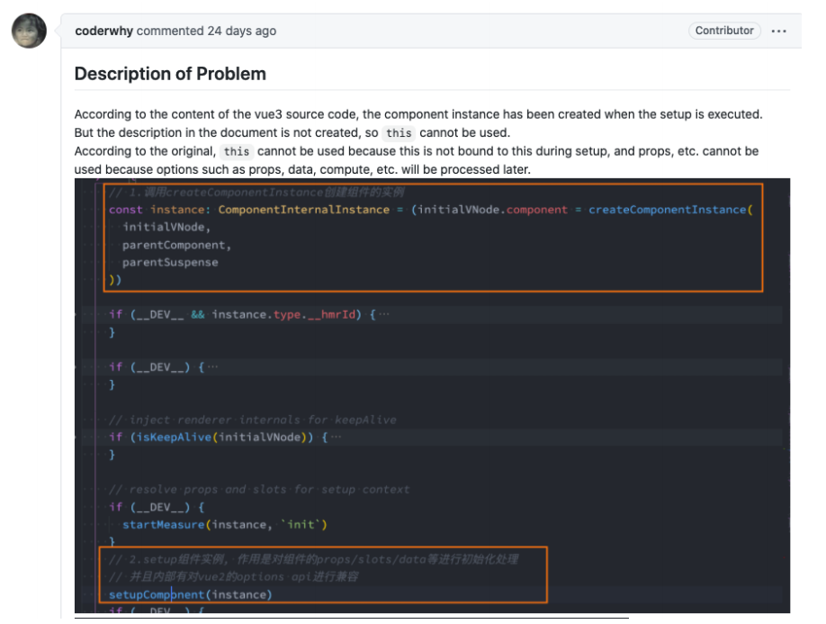
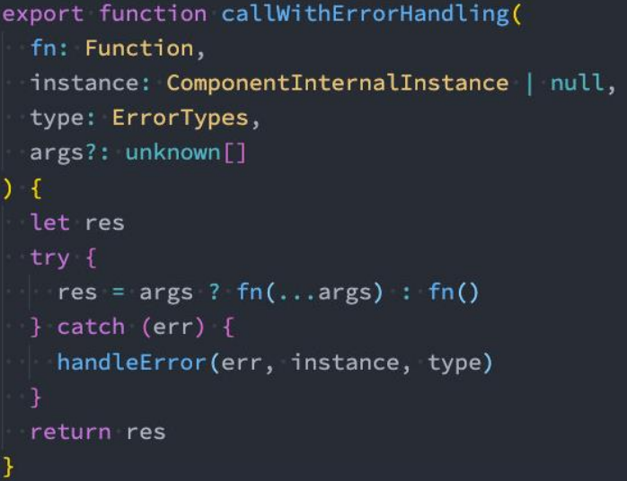

# 一. 认识 Composition API


## 1. Options API 的弊端

在 Vue2 中，我们编写组件的方式是 Options API：

  > Options API 的一大特点就是在对应的属性中编写对应的功能模块。  
  > 比如 data 中定义数据、methods 中定义方法、computed 中定义计算属性、watch 中监听属性改变，也包括生命周期钩子。
  
但是这种代码有一个很大的弊端：

  > 当我们实现某一个功能时，这个功能对应的代码逻辑会被拆分到各个属性中。  
  > 当我们组件变得更大、更复杂时，逻辑关注点的列表就会增长，那么同一个功能的逻辑就会被拆分的很分散。  
  > 尤其对于那些一开始没有编写这些组件的其他人来说，这个组件的代码是难以阅读和理解的。
  
  


## 2. 大组件的逻辑分散

下面我们来看一个非常大的组件，其中的逻辑功能按照颜色进行了划分：

  > 这种碎片化的代码使用理解和维护这个复杂的组件变得异常困难，并且隐藏了潜在的逻辑问题。  
  > 并且当我们处理单个逻辑关注点时，需要不断的跳到相应的代码块中。

  

如果我们能将同一个逻辑关注点相关的代码收集在一起会更好，这就是 `Composition API` 想要做的事情，以及可以帮助我们完成的事情，也有人把 `Vue Composition API` 简称为 `VCA`。


## 3. 认识 Composition API

那么既然知道 Composition API 想要帮助我们做什么事情，接下来看一下到底是怎么做呢？

  > 为了开始使用 Composition API，我们需要有一个可以实际使用它（编写代码）的地方。  
  > 在 Vue 组件中，这个位置就是 `setup` 函数。

setup 其实就是组件的另外一个选项：

  > 只不过这个选项强大到我们可以用它来替代之前所编写的大部分其他选项。  
  > 比如 methods、computed、watch、data、生命周期钩子等。

接下来我们一起学习这个函数的使用：

  > 函数的参数  
  > 函数的返回值


# 二. Setup 函数


## 1. 基本使用

`setup()` 钩子函数是在组件中使用 Composition API 的入口，通常只在以下情况下使用：

  > 1. 在非 SFC 中使用 Composition API 时。
  > 2. 在基于 Options API 的组件中集成基于 Composition API 的代码时。

::: warning
1. 对于结合 SFC 使用的 Composition API，推荐通过 `<script setup>` 以获得更简洁及符合人体工程学的语法。
2. [`<script setup>`](https://cn.vuejs.org/api/sfc-script-setup.html) 是在 SFC 中使用 Composition API 的 `编译时语法糖`。
:::

我们可以使用 [响应式 API](https://cn.vuejs.org/api/reactivity-core.html) 来声明响应式的状态，**在 setup() 函数中返回的对象 会暴露给模板和组件实例**。

其他的选项也可以通过组件实例来获取 setup() 暴露的属性：

```vue
<script>
import { ref } from 'vue'

export default {
  setup() {
    const count = ref(0)

    // 返回值会暴露给模板和其他的选项式 API 钩子
    return {
      count
    }
  },

  mounted() {
    console.log(this.count) // 0
  }
}
</script>

<template>
  <button @click="count++">{{ count }}</button>
</template>
```

在 template 中访问从 `setup()` 函数返回的 `ref` 时，它会[自动浅层解包](https://cn.vuejs.org/guide/essentials/reactivity-fundamentals.html#deep-reactivity)，
因此你无须再在模板中为它写 `.value`，当通过 `this` 访问时也会同样如此解包。

  > `setup()` 自身并不含对组件实例的访问权，即在 `setup()` 中访问 `this` 会是 `undefined`。你可以在 Options API 中访问 Composition API 暴露的值，但反过来则不行。  
  > `setup()` 应该同步地返回一个对象。唯一可以使用 `async setup()` 的情况是，该组件是 [Suspense](https://cn.vuejs.org/guide/built-ins/suspense.html) 组件的后代。


## 2. 参数

我们先来研究一个 `setup()` 函数的参数，它主要有两个参数： 

  > 第一个参数：`props`  
  > 第二个参数：`context`

setup() 钩子的第一个参数是组件的 `props`。

和标准的组件一致，一个 **`setup` 函数的 `props` 参数是响应式的**，并且会在传入新的 `props` 时同步更新：

  > 对于定义 props 的类型，我们还是和之前的规则是一样的，在 props 选项中定义。  
  > 并且在 `template` 中依然是可以正常去使用 props 中的属性，比如 message。  
  > 如果我们在 `setup` 函数中想要使用 props，那么不可以通过 `this` 去获取（后面会讲到为什么）。  
  > 因为 props 有直接作为参数传递到 `setup` 函数中，所以我们可以直接通过参数来使用即可

  ```js
  export default {
    props: {
      title: String
    },
    setup(props) {
      console.log(props.title)
    }
  }
  ```

::: warning
如果解构了 `props` 对象，解构出的变量将会丢失响应性，因此推荐通过 `props.xxx` 的形式来使用其中的 `props`。
:::

如果你确实需要解构 `props` 对象，或者需要将某个 `prop` 传到一个外部函数中并保持响应性。

**可以使用 `toRefs()` 和 `toRef()` 这两个工具函数来解构 props 对象并保持响应式**：

  ```js
  import { toRefs, toRef } from 'vue'
  
  export default {
    setup(props) {
      // 将 `props` 转为一个其中全是 ref 的对象，然后解构
      const { title } = toRefs(props)
      // `title` 是一个追踪着 `props.title` 的 ref
      console.log(title.value)
  
      // 或者，将 `props` 的单个属性转为一个 ref
      const title = toRef(props, 'title')
    }
  }
  ```

另外一个参数是 `context`，我们也称之为是一个 `Setup` 上下文： 

  ```js
  export default {
    setup(props, context) {
      // 透传 Attributes（非响应式的对象，等价于 $attrs）
      console.log(context.attrs)
  
      // 插槽（非响应式的对象，等价于 $slots）
      console.log(context.slots)
  
      // 触发事件（函数，等价于 $emit）
      console.log(context.emit)
  
      // 暴露公共属性（函数）
      console.log(context.expose)
    }
  }
  ```

  > `attrs`：所有的非 prop 的 attribute。  
  > `slots`：父组件传递过来的插槽（这个在以渲染函数返回时会有作用，后面会讲到）。  
  > `emit`：当组件内部需要发出事件时会用到 emit（因为不能访问 `this`，所以不可以通过 `this.$emit` 发出事件）。

**该上下文对象 `context` 是非响应式的，可以安全地解构**：

  ```js
  export default {
    setup(props, { attrs, slots, emit, expose }) {
      // ...
    }
  }
  ```

`expose` 函数用于显式地限制该组件暴露出的属性，当父组件通过模板引用访问该组件的实例时，将仅能访问 `expose` 函数暴露出的内容：

  ```js
  export default {
    setup(props, { expose }) {
      // 让组件实例处于 “关闭状态”
      // 即不向父组件暴露任何东西
      expose()
  
      const publicCount = ref(0)
      const privateCount = ref(0)
      // 有选择地暴露局部状态
      expose({ count: publicCount })
    }
  }
  ```


## 3. 返回值

setup 既然是一个函数，那么它也可以有返回值，它的返回值用来做什么呢？

  > 在 setup() 函数中返回的对象会暴露给 template 和组件实例。其他的选项也可以通过组件实例来获取 setup() 暴露的属性。  
  > 也就是说我们可以通过 `setup` 的返回值来替代 `data` 选项。

甚至是我们可以返回一个执行函数来代替在 methods 中定义的方法：

```vue
<template>
  <div>
    <h2>message: {{ message }}</h2>
    <button @click="changeMessage">修改message</button>
  </div>
</template>
<script>
  import { reactive } from 'vue'
  export default {
    setup() {
      // 1.定义普通的数据: 可以正常的被使用
      // 缺点: 数据不是响应式的
      let message = "Hello World"
      function changeMessage() {
        message = "你好啊,李银河!" // 这里发生改变，但template中的数据并不会同步修改
        console.log(message)
      }
      return {
        message,
        changeMessage,
      }
    }
  }
</script>
```

但是，如果我们将 message 在 changeMessage 中进行操作时，是否可以实现界面的响应式呢？

 > 答案是不可以。  
 > 这是因为对于一个定义的普通变量来说，默认情况下，Vue 并不会跟踪该变量的变化。


## 4. 与渲染函数一起使用

setup 也可以返回一个[渲染函数](https://cn.vuejs.org/guide/extras/render-function.html)，此时在渲染函数中可以直接使用在同一作用域下声明的响应式状态：

> Vue 提供了一个 `h()` 函数用于创建 `vnodes`

```js
import { h, ref } from 'vue'

export default {
  setup() {
    const count = ref(0)
    return () => h('div', count.value)
  }
}
```

返回一个渲染函数将会阻止我们返回其他东西。对于组件内部来说，这样没有问题，但如果我们想通过 template 引用将这个组件的方法暴露给父组件，那就有问题了。

> 我们可以通过调用 `expose()` 解决这个问题：

```js
import { h, ref } from 'vue'

export default {
  setup(props, { expose }) {
    const count = ref(0)
    const increment = () => ++count.value

    expose({
      increment
    })

    return () => h('div', count.value)
  }
}
```

此时父组件可以通过 template 引用来访问这个 increment 方法。


# 三. Setup 中数据的响应式
::: info
在 Vue 3 的 Composition API 中，我们通常在 setup() 内声明状态。如果希望这些状态 “能引起视图更新”，就必须让它们具有响应式能力。

Vue 提供两大核心 API：
- reactive() —— 让对象变成深层响应式
- ref() —— 让任意值类型（包含原始值）拥有响应式能力
:::


## Reactive: 让对象变成深层响应式

### 基本用法
如果想为在 `setup` 中定义的数据提供响应式的特性，那么我们可以使用 `reactive` 函数： 

```vue
<template>
  <div>
    <h2>账号: {{ account.username }}</h2>
    <h2>密码: {{ account.password }}</h2>
    <button @click="changeAccount">修改账号</button>
  </div>
</template>

<script>
import { reactive } from 'vue'

export default {
  setup() {
    // 定义响应式数据
    // reactive函数: 定义复杂类型的数据
    const account = reactive({
      username: "coderwhy",
      password: "123456"
    })
    function changeAccount() {
      account.username = "kobe"
    }
    return {
      account,
      changeAccount,
    }
  }
}
</script>
```

那么这是什么原因呢？为什么就可以变成响应式的呢？

  > 这是因为当我们使用 reactive 函数处理我们的数据之后，会返回一个 Proxy 代理对象。  
  > 当该 Proxy 的属性被访问（getter）时就会进行依赖收集。  
  > 当属性被修改（setter）时，所有收集到的依赖都是进行对应的响应式操作（比如视图更新）。    
  > 事实上，我们编写的 data 选项，Vue 在内部也是交给了 reactive 函数将其变成响应式对象的。
  
### 特性与细节

`reactive()` 返回的是一个原始对象的 `Proxy` 代理对象，这个代理对象和原始对象是不相等的，只有代理对象是响应式的，更改原始对象不会触发更新:

  ```js
  const raw = {}
  const proxy = reactive(raw)
  
  // 代理对象和原始对象是不相等
  proxy == raw  // false
  proxy === raw // false
  ```

为保证访问代理的一致性，对同一个原始对象多次调用 reactive()，返回的都是同一个代理对象：

  ```js
  const raw = {}
  const proxy = reactive(raw)
  const proxy2 = reactive(raw)

  proxy2 === proxy  // true
  ```

而对一个已存在的代理对象调用 `reactive()`，会返回该代理对象本身：

  ```js
  const raw = {}
  const proxy = reactive(raw)

  reactive(proxy) === proxy // true
  ```

这个规则对嵌套对象也适用。**依靠深层响应性，响应式对象内的嵌套对象也会自动变成响应式，依然是代理**：

  ```js
  const proxy = reactive({})

  const raw = {}
  proxy.nested = raw

  proxy.nested === raw           // false（已变为代理）
  proxy.nested === reactive(raw) // true
  ```

::: tip
在 Vue 中，**状态都是默认深层响应式的**。这意味着即使在更改深层次的对象或数组，你的改动也能被检测到。
你也可以直接创建一个[浅层响应式对象](https://cn.vuejs.org/api/reactivity-advanced.html#shallowreactive)。它们仅在顶层具有响应性，一般仅在某些特殊场景中需要。
:::

### 局限性

- **限制 1：只能用于对象类型。**

> 对传入的类型是有限制的，仅对对象类型有效（对象、数组和 Map、Set 这样的[集合类型](https://developer.mozilla.org/zh-CN/docs/Web/JavaScript/Reference/Global_Objects#使用键的集合对象)），
而对 string、number 和 boolean 这样的 [原始类型](https://developer.mozilla.org/zh-CN/docs/Glossary/Primitive) 无效，会报一个警告。

```js
reactive(1) // !警告：Cannot reactive a non-object value.
```

- **限制 2：不能替换整个对象**

> 因为 Vue 的响应式系统是通过属性访问进行追踪的，因此我们必须始终保持对该响应式对象的相同引用。
> 这意味着我们不可以随意地“替换”一个响应式对象，因为这将导致对初始引用的响应性连接丢失。

```js
let state = reactive({ count: 0 })

// 上面的引用 ({ count: 0 }) 引用将不再被追踪（原引用的响应性丢失！）
state = reactive({ count: 1 }) 
```

- **限制 3：原始类型的属性解构或赋值至本地变量时，会丢失响应性**

> 将响应式对象的原始类型的属性构或赋值至本地变量时，会失去响应性。非原始类型的属性则不会出现这个问题。

```js
const state = reactive({ count: 0, obj: { a: 1 }, arr: [1, 2] })

let n = state.count // 原始类型的属性赋值，同 state.count 失去响应性连接
n++ // 不会触发 state.count 的响应式更新

let { count } = state // 原始类型的属性解构，同 state.count 失去响应性连接
count++ // 不会触发 state.count 的响应式更新

let a = state.obj.a // 原始类型的属性赋值，同 state.obj.a 失去响应性连接
a++ // 不会触发 state.obj.a 的响应式更新

let { a } = state.obj // 原始类型的属性解构，同 state.obj.a 失去响应性连接
a++ // 不会触发 state.obj.a 的响应式更新

// 非原始类型的属性不会出现这个问题，比如 state.obj 是一个引用类型属性
let obj = state.obj // 引用类型的属性赋值，同 state.obj 保持响应性连接
obj.a++ // 会触发 state.obj.a 的响应式更新

let { obj } = state // 引用类型的属性解构，同 state.obj 保持响应性连接
obj.a++ // 会触发 state.obj.a 的响应式更新

let { arr } = state // 引用类型的属性解构，同 state.arr 保持响应性连接
arr[0]++ // 会触发 state.arr[0] 的响应式更新
```

- **限制 4：原始类型的属性在函数传参时，会丢失响应性**

> 将响应式对象的原始类型的属性传入一个函数时，会失去响应性。引用类型的属性则不会出现这个问题。

```js
const state = reactive({ count: 0, obj: { a: 1 }, arr: [1, 2] })

const foo = n => n++
foo(state.count) // 原始类型的属性传参，同 state.count 失去响应性连接

const bar = obj => obj.a++
bar(state.obj) // 引用类型的属性传参，同 state.obj 保持响应性连接

const fn = arr => arr[0]++
fn(state.arr) // 引用类型的属性传参，同 state.arr 保持响应性连接
```

reactive() 的种种限制归根结底是因为 js 没有可以作用于所有值类型的 “引用” 机制。  
于是 ref() 出现了。


## Ref: 为任意值创建响应式“引用”

::: info
Vue 提供了一个 [`ref()`](https://cn.vuejs.org/api/reactivity-core.html#ref) 方法来允许我们**创建可以使用任何值类型的响应式 ref**。
:::


### 基本用法

`ref()` 接收参数，并将该参数包裹在一个带有 `.value` 属性的 ref 对象中返回：

  ```js
  import { ref } from 'vue'

  const count = ref(0)
  
  console.log(count)        // { value: 0 }
  console.log(count.value)  // 0
  
  count.value++
  console.log(count.value)  // 1
  ```

和响应式对象的属性类似，**ref 的 value 属性本身也是响应式的**。

要在组件模板中访问 ref，请从组件的 `setup()` 函数中声明并返回它们：

::: warning
在模板中使用 ref 时，不需要附加 `.value`。为了方便起见，当在模板中使用时，ref 会自动解包 ([有一些注意事项](#模板中访问顶层属性))。
但在 setup() 内部，它依然是一个 ref 引用，需要使用 ref.value 的方式对其进行操作。
:::

::: code-group
```js [script]
import { ref } from 'vue'

export default {
  // `setup` 是一个特殊的钩子，专门用于组合式 API。
  setup() {
    const count = ref(0)
    
    // setup 内部操作 ref，需要使用 .value
    const increment = () => count.value++

    // 将 ref 暴露给模板
    return {
      count,
      increment
    }
  }
}
```
```html [template]
<div>{{ count }}</div> <!-- 自动解包，不需要.value -->
<button @click="increment">count++</button>
```
:::


### 特性

- **可以包裹任意类型（包含原始值）**

```js
ref(0)
ref('abc')
ref(true)
ref({ a: 1 })
ref([1,2,3])
```

- **整体替换依然响应式**

> 一个包含对象类型值的 ref 可以响应式地替换整个对象。  
> 当值为对象类型时，会自动用 reactive() 转换它的 `.value`。

```js
const objectRef = ref({ count: 0 })
objectRef.value = { count: 1 } // 这是响应式的替换，整体替换依然响应式
```

- **传递、解构、传参都不会失去响应性**
> ref 被传递给函数或是从一般对象上被解构时，不会丢失响应性。

```js
const obj = {
  foo: ref(1),
  bar: ref(2)
}

// 该函数接收一个 ref，需要通过 .value 取值，但它会保持响应性
callSomeFunction(obj.foo)

// 仍然是响应式的
const { foo, bar } = obj
```

简言之，`ref()` 让我们能创造一种对任意值的 “引用”，并能够在不丢失响应性的前提下传递这些引用。

这个功能很重要，因为它经常用于将逻辑提取到 [组合函数](https://cn.vuejs.org/guide/reusability/composables.html) 中。

**`ref()` 会返回一个可变的响应式对象**，该对象作为一个响应式的引用维护着它内部的值，这就是 ref 名称的来源。
**它内部的值是在 ref 的 value 属性中被维护的**。


## Ref 自动解包

### 模板中解包的注意事项

在模版中使用 ref 时，只有模板渲染上下文中顶级的 `ref` 属性，才会被自动“解包”，不需要写 `.value`：

```vue
<template>
  <!-- 不需要 .value，自动解包，等价于 => count.value -->
  <div>{{ count }}</div> 
</template>

<script>
import { ref } from 'vue'

export default {
  setup() {
    // count 是模板渲染上下文中的顶级属性的 ref
    const count = ref(0) 
    
    return { count }
  }
}
</script>
```

仅当 ref 是模板渲染上下文的顶级属性时才适用自动“解包”，不是顶级属性时就不会解包：

```js
// 本例中：count 和 object 是顶级属性，
// 但 object.id ref 不是顶级属性（其只是模板渲染上下文中的顶级属性 object 的一个子属性）
const count = ref(0)
const object = { id: ref(1) }

// 因此，下面这个表达式按预期工作：
// count 既是模版渲染上下文中的顶级属性，又是 Ref 对象，因此会自动解包
{{ count + 1 }} // 渲染结果为：1

// 但下面这个表达式不会，为什么？
// 第一点：object 虽然是模板上下文中的一个顶级属性，但它只是一个普通对象，不是 ref 对象
// 第二点：object.id 虽然是 ref 对象，但它不是模板渲染上下文中的顶级属性
// 所以在计算表达式时，object.id 没有被解包，object.id 得到的是 => Ref{...}（仍然是一个 ref 对象）。
{{ object.id + 1 }} // 预期渲染结果为：2，实际渲染结果为："[object Object]1"
```

为了解决这个问题，我们可以将 id 解构为一个顶级属性：

```js
const { id } = object // 这下 id 就是模板渲染上下文中的顶级 ref 属性了

{{ id + 1 }} // 现在渲染结果为：2
```

但实际情况中，发现不是顶级的 ref 属性时，也能自动解包，如下：

```js
const object = { foo: ref(1) }

{{ object.foo }} // 渲染结果：1（这是为什么呢？，不是说只有顶级的 ref 属性才能自动解包吗？）
```

这其实是文本插值的一个便利特性：如果 ref 是文本插值的最终计算值 (即 "Mustache" 双大括号标签)，即使不是作为顶层属性被访问，也会被自动解包。

```js
const object = { foo: ref(1) }

{{ object.foo }} // 等价于 => {{ object.foo.value }}
// 运行渲染结果将为 1
```

尽管 object.foo 不是顶层属性，本身不会解包，但：
> 在 插值表达式的最终值 是 ref 时，Vue 会对“最终值”执行一次自动取 .value。

```js
{{ object.foo }} // 等价于 => {{ object.foo.value }}
```

但若不是最终计算值，比如参与了运算，则不会被自动解包：：

```js
const obj = { foo: ref(1) }
const obj2 = { foo: ref(2) }

{{ obj.foo + 1 }}         // => "[object Object]1"
{{ obj.foo + obj2.foo }}  // => "[object Object][object Object]1"
```

> 此时表达式 `obj.foo + 1` 的最终值不是 ref，而是：“ref 对象” + “数字” => 得到 "[object Object]1"。


### setup 中解包的注意事项


#### 能解包的场景 - 作为 reactive 对象的属性

在 setup 中，当 ref 在作为深层响应式对象的属性被访问或修改时，会自动解包。换句话说，它的行为就像一个普通的属性：

```js
const count = ref(0)
const state = reactive({ count })

console.log(state.count)  // 0（不需要写成：state.count.value）

state.count = 1           // 不需要写成：state.count.value = 1
console.log(count.value)  // 1
```

::: warning
只有当 ref 嵌套在一个深层响应式对象内时，才会发生 ref 解包。作为浅层响应式对象的属性时不会解包。

[浅层响应式对象](https://cn.vuejs.org/api/reactivity-advanced.html#shallowreactive)：reactive 的浅层作用形式，即 shallowReactive。

::: details 示例
```js
// obj是深层响应式对象，访问其 ref 属性时，不需要写 .value
const obj = reactive({
  count: ref(0)
})
obj.count         // 0 

// obj2 是浅层响应式对象，访问其 ref 属性时，需要写 .value
const obj2 = shallowReactive({ 
  count: ref(1)
})
obj2.count        // Ref {...}
obj2.count.value  // 1
```
:::

如果将一个新的 ref 赋值给一个 reactive 对象中关联了已有 ref 的属性，那么它会替换掉旧的 ref：

```js
const raw_ref = ref(0)
const state = reactive({ _ref: raw_ref })

const new_ref = ref(2)

state._ref = new_ref    // raw_ref 现在已经和 state._ref 失去联系
console.log(state._ref) // 2
```


#### 不能解包的场景

在 setup 中，当 ref 作为普通对象、数组、 原生集合类型（如Map）、响应式数组、响应式原生集合类型中的元素被访问时，不会自动解包。  
> 与 reactive 对象不同的是，即使是在访问 reactive 包裹调用的响应式数组或 响应式Map 时，ref 的值也不会自动解包。
```js
// 1. 当 ref 作为普通对象的属性时，在 setup 中，访问需要带.value
const raw_obj = { n: ref(0) }
console.log(raw_obj.n) // ref {...}
console.log(raw_obj.n.value) // 0

// 2. 当 ref 作为 reative 对象属性时，在 setup 中，访问不需要带.value
const reative_obj = reactive(raw_obj)
console.log(reative_obj.n) // 0

// 3. 当 ref 作为数组元素时，在 setup 中，访问需要带.value
const raw_arr = [ref(0)]
console.log(raw_arr[0]) // ref {...}
console.log(raw_arr[0].value) // 0

// 4. 当 ref 作为 reactive 数组元素时，在 setup 中，访问需要带.value
const reative_arr = reactive(raw_arr)
console.log(reative_arr[0]) // ref {...}
console.log(reative_arr[0].value) // 0

// 5. 当 ref 作为 Map 的元素时，在 setup 中，访问需要带.value
const raw_map = new Map([['count', ref(0)]])
console.log(raw_map.get('count')) // ref {...}
console.log(raw_map.get('count').value) // 0

// 6. 当 ref 作为 reactive Map 的元素时，在 setup 中，访问需要带.value
const reactive_map = reactive(raw_map)
console.log(reactive_map.get('count')) // Proxy {...}
console.log(reactive_map.get('count').value) // 0
```

## ref 和 reactive 的应用场景

```vue
<template>
  <div>
    <form>
      账号: <input type="text" v-model="account.username">
      密码: <input type="password" v-model="account.password">
    </form>
    <form>
      账号: <input type="text" v-model="username">
      密码: <input type="password" v-model="password">
    </form>
  </div>
</template>

<script>
import { onMounted, reactive, ref } from 'vue'

export default {
  setup() {
    // 定义响应式数据: reactive/ref
    // 强调: ref也可以定义复杂的数据
    const info = ref({})
    console.log(info.value)
    // 1.reactive的应用场景
    // 1.1.条件一: reactive应用于本地的数据
    // 1.2.条件二: 多个数据之间是有关系/联系，如form表单(聚合的数据, 组织在一起会有特定的作用)
    const account = reactive({
      username: "coderwhy",
      password: "1234567"
    })
    const username = ref("coderwhy")
    const password = ref("123456")
    // 2.ref的应用场景: 其他的场景基本都用ref(computed)
    // 2.1.定义本地的一些简单数据
    const message = ref("Hello World")
    const counter = ref(0)
    const name = ref("why")
    const age = ref(18)
    // 2.定义从网络中获取的数据也是使用ref
    // const musics = reactive([])
    const musics = ref([])
    onMounted(() => {
      const serverMusics = ["海阔天空", "小苹果", "野狼"]
      musics.value = serverMusics
    })
    return {
      account,
      username,
      password,
      name,
      age
    }
  }
}
</script>
```


# 四. 认识 readonly 函数

::: info
我们通过 `reactive` 或者 `ref` 可以获取到一个响应式的对象，但是某些情况下，我们传入给其他地方（组件）的这个响应式对象希望在另外一个地方（组件）被使用，但是不能被修改，这个时候如何防止这种情况的出现呢？

答案是 Vue3 为我们提供了 `readonly` 的方法。
:::

## 认识 readonly()

readonly 会`返回原始对象的只读代理`（也就是它依然是一个 `Proxy`，但其 `set` 方法被劫持，并且不能对其进行修改）。

- 只读代理是深层的：对任何嵌套属性的访问都将是只读的。它的 `ref` 解包行为与 `reactive()` 相同，但解包得到的值是只读的

- 要避免深层级的转换行为，请使用 [shallowReadonly()](https://cn.vuejs.org/api/reactivity-advanced.html#shallowreadonly) 作替代

- 在开发中常见的 `readonly` 方法会传入三个类型的参数：

  - 类型一：普通对象

  - 类型二：`reactive` 返回的对象

  - 类型三：`ref` 的对象

    


## readonly 的使用

- 在 `readonly` 的使用过程中，有如下规则：
  - `readonly` 返回的对象都是不允许修改的
  - 但是经过 `readonly` 处理的原来的对象是允许被修改的
    - 比如 `const info = readonly(obj)`，`info` 对象是不允许被修改的
    - 当 `obj` 被修改时，`readonly` 返回的 `info` 对象也会被修改
    - 但是我们不能去修改 `readonly` 返回的对象 `info`
- 其实本质上就是 `readonly` 返回的对象的 `setter` 方法被劫持了而已

## 3. readonly 的应用

- 那么这个 `readonly` 有什么用呢？
  - **在传递给其他组件数据时，防止其他组件修改我们传递的数据时，就可以使用 `readonly` 了**
  - 其实就是为了**保持单项数据流**


# 五. Reactive 知识点补充

---

## 1. Reactive 判断的 API

- `isProxy()`
  - 检查对象是否是由 `reactive()`、`readonly()`、`shallowReactive()`或`shallowReadonly()` 创建的代理
- `isReactive()`
  - 检查一个对象是否是由 `reactive()` 或 `shallowReactive()` 创建的代理
  - 如果该代理是 `readonly` 建的，但包裹了由 `reactive` 创建的另一个代理，它也会返回 `true`
- `isReadonly()`
  - 检查传入的值是否为只读对象。只读对象的属性可以更改，但他们不能通过传入的对象直接赋值
  - 通过 `readonly()` 和 `shallowReadonly()` 创建的代理都是只读的，因为他们是没有 `set` 函数的 `computed()` `ref`
- `toRaw()`
  - 返回 `reactive` 或 `readonly` 代理的原始对象（不建议保留对原始对象的持久引用。请谨慎使用）
- `shallowReactive()`
  - 创建一个响应式代理，它跟踪其自身 `property` 的响应性，但不执行嵌套对象的深层响应式转换 (深层还是原始对象)
- `shallowReadonly()`
  - 创建一个 `proxy`，使其自身的 `property` 为只读，但不执行嵌套对象的深度只读转换（深层还是可读、可写的）


# 六. Ref 知识点补充

---

## 1. toRefs()

- 如果我们**使用 `ES6` 的解构语法，对 `reactive` 返回的对象进行解构获取值，那么之后无论是修改结构后的变量，还是修改 `reactive` 返回的 `info` 对象，数据都不再是响应式的**：

- 那么有没有办法让我们解构出来的属性是响应式的呢？
  - `Vue` 为我们提供了一个 `toRefs` 的函数，可以将 `reactive` 返回的对象中的属性都转成 `ref`
  - 那么我们再次进行结构出来的 `name` 和 `age` 本身都是 `ref` 的
  
- 这种做法相当于已经在 `info.name` 和 `ref.value` 之间建立了链接，任何一个修改都会引起另外一个变化

  ```vue
  <script>
    import { reactive, toRefs } from 'vue'
    export default {
      setup() {
        const info = reactive({
          name: "why",
          age: 18,
          height: 1.88
        })
        // reactive被解构后会变成普通的值, 失去响应式
        const { name, age } = info
        // toRefs包裹的对象，对其结构出来的变量是响应式的
        const { name, age } = toRefs(info)
        return {
          name,
          age
        }
      }
    }
  </script>
  ```

## 2. toRef()

- 如果我们只希望转换 `reactive` 对象中单独的某一个属性为 `ref` 时，那么可以使用 `toRef` 的方法：

- 就是单独解构某一个属性而已

  ```vue
  <script>
    import { reactive, toRefs, toRef } from 'vue'
    export default {
      setup() {
        const info = reactive({
          name: "why",
          age: 18,
          height: 1.88
        })
        // reactive 被解构后会变成普通的值, 失去响应式
        const { name, age } = info
        // toRefs 包裹的对象，对其结构出来的变量是响应式的
        const { name, age } = toRefs(info)
        const height = toRef(info, "height")
        return {
          name,
          age
        }
      }
    }
  </script>
  ```

  

## 3. ref 其他的 API

- `unref()`

- 如果我们想要获取一个 `ref` 引用中的 `value`，那么也可以通过 `unref` 方法： 
  - 如果参数是一个 `ref`，则返回内部值，否则返回参数本身
  - 这是 `val = isRef(val) ? val.value : val` 的语法糖函数
  
- `isRef()`
  
  - 判断值是否是一个 `ref` 对象
  
- `shallowRef()`
  
  - 创建一个浅层的 `ref` 对象
  
- `triggerRef()`
  
  - 手动触发和 `shallowRef` 相关联的副作用
  
    ```js
    const shallow = shallowRef({
      greet: 'Hello, world'
    })
    
    // 触发该副作用第一次应该会打印 "Hello, world"
    watchEffect(() => {
      console.log(shallow.value.greet)
    })
    
    // 这次变更不应触发副作用，因为这个 ref 是浅层的
    shallow.value.greet = 'Hello, universe'
    
    // 打印 "Hello, universe"
    triggerRef(shallow)
    
    ```


# 七. setup 中禁用 this

---

## 1. setup 不可以使用 this

- 官方关于 `this` 有这样一段描述（这段描述是我给官方提交了 `PR` 之后的一段描述）：
  - 表达的含义是 `this` 并没有指向当前组件实例
  
  - 并且在 `setup` 被调用之前，`data`、`computed`、`methods` 等都没有被解析
  
  - 所以无法在 `setup` 中获取 `this`
  
    

- 其实在之前的这段描述是和源码有出入的（我向官方提交了 `PR`，做出了描述的修改）：
  - 之前的描述大概含义是不可以使用 `this` 是因为组件实例还没有被创建出来
  - 后来我的 `PR` 也有被合并到官方文档中

## 2. 之前关于 this 的描述问题



## 3. 我是如何发现官方文档的错误的呢？

- 在阅读源码的过程中，代码是按照如下顺序执行的：
  - 调用 `createComponentInstance` 创建组件实例
  - 调用 `setupComponent` 初始化 `component` 内部的操作
  - 调用 `setupStatefulComponent` 初始化有状态的组件
  - 在 `setupStatefulComponent` 取出了 `setup` 函数
  - 通过 `callWithErrorHandling` 的函数执行 `setup`
  
- 从上面的代码我们可以看出，组件的 `instance` 肯定是在执行 `setup` 函数之前就创建出来的

  
